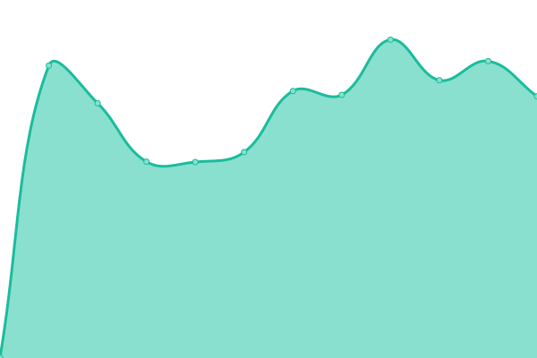
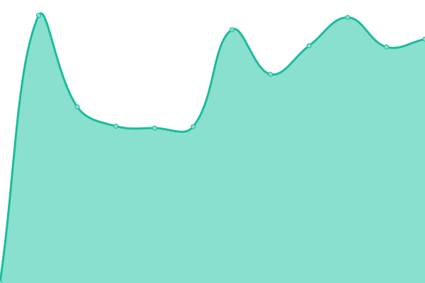
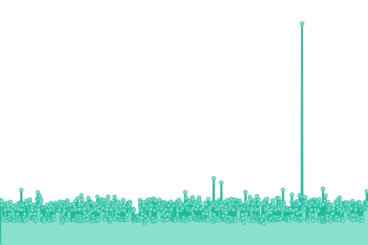
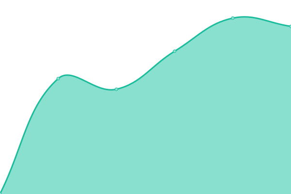
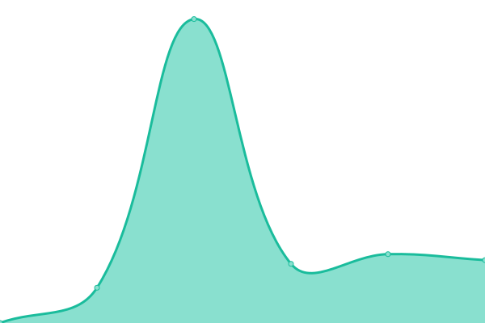
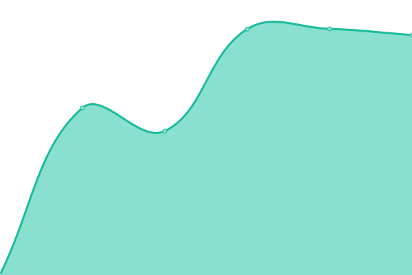
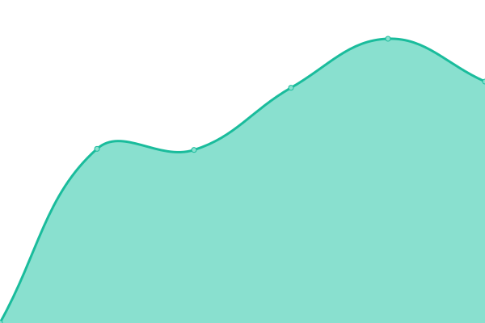
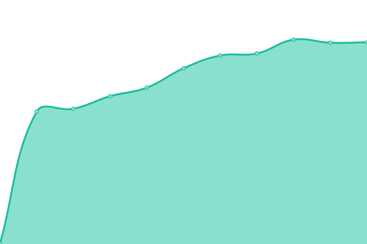

# [📈 Live Status](https://chris9091.github.io/Fleksa-Monitor-2): <!--live status--> **🟧 Partial outage**

This repository contains the open-source uptime monitor and status page for [chris9091](https://chris9091.github.io/Fleksa-Monitor-2), powered by [Upptime](https://github.com/upptime/upptime).

With [Upptime](https://upptime.js.org), you can get your own unlimited and free uptime monitor and status page, powered entirely by a GitHub repository. We use [Issues](https://github.com/chris9091/Fleksa-Monitor-2/issues) as incident reports, [Actions](https://github.com/chris9091/Fleksa-Monitor-2/actions) as uptime monitors, and [Pages](https://chris9091.github.io/Fleksa-Monitor-2) for the status page.

<!--start: status pages-->
<!-- This summary is generated by Upptime (https://github.com/upptime/upptime) -->
<!-- Do not edit this manually, your changes will be overwritten -->
<!-- prettier-ignore -->
| URL | Status | History | Response Time | Uptime |
| --- | ------ | ------- | ------------- | ------ |
|  [Robertino's Bella Italia](https://bellaitalia.xn--nrnberger-pizzaservice-slc.de) | 🟩 Up | [robertino-s-bella-italia.yml](https://github.com/chris9091/Fleksa-Monitor-2/commits/HEAD/history/robertino-s-bella-italia.yml) | 

 2753ms
     
 | 

<a href="https://chris9091.github.io/Fleksa-Monitor-2/history/robertino-s-bella-italia">98.79%</a>
    

|  [Pizza Pronto Düsseldorf](https://pizzapronto-dus.de) | 🟥 Down | [pizza-pronto-duesseldorf.yml](https://github.com/chris9091/Fleksa-Monitor-2/commits/HEAD/history/pizza-pronto-duesseldorf.yml) | 

 867ms
     
 | 

<a href="https://chris9091.github.io/Fleksa-Monitor-2/history/pizza-pronto-duesseldorf">0.00%</a>
    

|  [Pizzeria Brescia Duisburg](https://bresciapizzeria.de) | 🟩 Up | [pizzeria-brescia-duisburg.yml](https://github.com/chris9091/Fleksa-Monitor-2/commits/HEAD/history/pizzeria-brescia-duisburg.yml) | 

 2657ms
     
 | 

<a href="https://chris9091.github.io/Fleksa-Monitor-2/history/pizzeria-brescia-duisburg">98.82%</a>
    

|  [Donau Lieferservice](https://donaulieferservice.de) | 🟩 Up | [donau-lieferservice.yml](https://github.com/chris9091/Fleksa-Monitor-2/commits/HEAD/history/donau-lieferservice.yml) | 

 1110ms
     
 | 

<a href="https://chris9091.github.io/Fleksa-Monitor-2/history/donau-lieferservice">98.83%</a>
    

|  [Gasthof Zum Bahnhof Lieferservice](https://gasthofgaum.de) | 🟩 Up | [gasthof-zum-bahnhof-lieferservice.yml](https://github.com/chris9091/Fleksa-Monitor-2/commits/HEAD/history/gasthof-zum-bahnhof-lieferservice.yml) | 

 1026ms
     
 | 

<a href="https://chris9091.github.io/Fleksa-Monitor-2/history/gasthof-zum-bahnhof-lieferservice">98.85%</a>
    

|  [Restaurant Maharaja](https://maharajasenden.de) | 🟩 Up | [restaurant-maharaja.yml](https://github.com/chris9091/Fleksa-Monitor-2/commits/HEAD/history/restaurant-maharaja.yml) | 

 974ms
     
 | 

<a href="https://chris9091.github.io/Fleksa-Monitor-2/history/restaurant-maharaja">98.86%</a>
    

|  [Pizza Caldo Ulm](https://pizzeriacaldo.de) | 🟩 Up | [pizza-caldo-ulm.yml](https://github.com/chris9091/Fleksa-Monitor-2/commits/HEAD/history/pizza-caldo-ulm.yml) | 

 1091ms
     
 | 

<a href="https://chris9091.github.io/Fleksa-Monitor-2/history/pizza-caldo-ulm">98.87%</a>
    

|  [Holzkirchen Pizzaservice](https://pizzaholzkirchen.de) | 🟩 Up | [holzkirchen-pizzaservice.yml](https://github.com/chris9091/Fleksa-Monitor-2/commits/HEAD/history/holzkirchen-pizzaservice.yml) | 

 1096ms
     
 | 

<a href="https://chris9091.github.io/Fleksa-Monitor-2/history/holzkirchen-pizzaservice">98.89%</a>
    

|  [Restaurant Dhaba](https://dhaba-holzkirchen.de) | 🟩 Up | [restaurant-dhaba.yml](https://github.com/chris9091/Fleksa-Monitor-2/commits/HEAD/history/restaurant-dhaba.yml) | 

 1098ms
     
 | 

<a href="https://chris9091.github.io/Fleksa-Monitor-2/history/restaurant-dhaba">98.90%</a>
    

|  [Royal India Sonthofen](https://sonthofen-royalindia.de) | 🟩 Up | [royal-india-sonthofen.yml](https://github.com/chris9091/Fleksa-Monitor-2/commits/HEAD/history/royal-india-sonthofen.yml) | 

 1074ms
     
 | 

<a href="https://chris9091.github.io/Fleksa-Monitor-2/history/royal-india-sonthofen">98.92%</a>
    

|  [Restaurant Piccolo](https://piccolo-express.de) | 🟩 Up | [restaurant-piccolo.yml](https://github.com/chris9091/Fleksa-Monitor-2/commits/HEAD/history/restaurant-piccolo.yml) | 

 929ms
     
 | 

<a href="https://chris9091.github.io/Fleksa-Monitor-2/history/restaurant-piccolo">98.93%</a>
    

|  [Ristorante Bella India](https://haweli-ottobeuren.de) | 🟩 Up | [ristorante-bella-india.yml](https://github.com/chris9091/Fleksa-Monitor-2/commits/HEAD/history/ristorante-bella-india.yml) | 

 927ms
     
 | 

<a href="https://chris9091.github.io/Fleksa-Monitor-2/history/ristorante-bella-india">99.52%</a>
    

|  [Bombay Palace](https://bombaypalace-muc.de) | 🟩 Up | [bombay-palace.yml](https://github.com/chris9091/Fleksa-Monitor-2/commits/HEAD/history/bombay-palace.yml) | 

 978ms
     
 | 

<a href="https://chris9091.github.io/Fleksa-Monitor-2/history/bombay-palace">98.96%</a>
    

|  [Lovely Pizza](https://lovelypizza-muc.de) | 🟩 Up | [lovely-pizza.yml](https://github.com/chris9091/Fleksa-Monitor-2/commits/HEAD/history/lovely-pizza.yml) | 

 2639ms
     
 | 

<a href="https://chris9091.github.io/Fleksa-Monitor-2/history/lovely-pizza">98.98%</a>
    

|  [Restaurant In-dish](https://xn--indishmnchen-jlb.de) | 🟩 Up | [restaurant-in-dish.yml](https://github.com/chris9091/Fleksa-Monitor-2/commits/HEAD/history/restaurant-in-dish.yml) | 

 1080ms
     
 | 

<a href="https://chris9091.github.io/Fleksa-Monitor-2/history/restaurant-in-dish">98.99%</a>
    

|  [Pizza Tandoori](https://pizzatandoori-fs.de) | 🟩 Up | [pizza-tandoori.yml](https://github.com/chris9091/Fleksa-Monitor-2/commits/HEAD/history/pizza-tandoori.yml) | 

 1064ms
     
 | 

<a href="https://chris9091.github.io/Fleksa-Monitor-2/history/pizza-tandoori">99.01%</a>
    

|  [Shiva's Garden](https://shiva-garten.de) | 🟩 Up | [shiva-s-garden.yml](https://github.com/chris9091/Fleksa-Monitor-2/commits/HEAD/history/shiva-s-garden.yml) | 

 2667ms
     
 | 

<a href="https://chris9091.github.io/Fleksa-Monitor-2/history/shiva-s-garden">99.02%</a>
    

|  [Escobar Pizza & Pasta](https://xn--escobar-nrnberg-7vb.de) | 🟩 Up | [escobar-pizza-and-pasta.yml](https://github.com/chris9091/Fleksa-Monitor-2/commits/HEAD/history/escobar-pizza-and-pasta.yml) | 

 933ms
     
 | 

<a href="https://chris9091.github.io/Fleksa-Monitor-2/history/escobar-pizza-and-pasta">99.04%</a>
    

|  [Restaurant Latakia](https://xn--latakia-nrnberg-7vb.de) | 🟩 Up | [restaurant-latakia.yml](https://github.com/chris9091/Fleksa-Monitor-2/commits/HEAD/history/restaurant-latakia.yml) | 

 2550ms
     
 | 

<a href="https://chris9091.github.io/Fleksa-Monitor-2/history/restaurant-latakia">99.05%</a>
    

|  [Prima Pizza Neufahrn](https://prima-neufahrn.de) | 🟩 Up | [prima-pizza-neufahrn.yml](https://github.com/chris9091/Fleksa-Monitor-2/commits/HEAD/history/prima-pizza-neufahrn.yml) | 

 993ms
     
 | 

<a href="https://chris9091.github.io/Fleksa-Monitor-2/history/prima-pizza-neufahrn">99.07%</a>
    

|  [Food Corner Moosburg](https://foodcorner-moosburg.de) | 🟩 Up | [food-corner-moosburg.yml](https://github.com/chris9091/Fleksa-Monitor-2/commits/HEAD/history/food-corner-moosburg.yml) | 

 1283ms
     
 | 

<a href="https://chris9091.github.io/Fleksa-Monitor-2/history/food-corner-moosburg">99.08%</a>
    

|  [Der Kleine Inder](https://der-kleineinder.de) | 🟩 Up | [der-kleine-inder.yml](https://github.com/chris9091/Fleksa-Monitor-2/commits/HEAD/history/der-kleine-inder.yml) | 

 924ms
     
 | 

<a href="https://chris9091.github.io/Fleksa-Monitor-2/history/der-kleine-inder">99.09%</a>
    

|  [Haveli Restaurant](https://haveliforchheim.de) | 🟩 Up | [haveli-restaurant.yml](https://github.com/chris9091/Fleksa-Monitor-2/commits/HEAD/history/haveli-restaurant.yml) | 

 955ms
     
 | 

<a href="https://chris9091.github.io/Fleksa-Monitor-2/history/haveli-restaurant">99.11%</a>
    

|  [Royal King Restaurant u. Pizzaservice](https://zurpost-royalking.de) | 🟩 Up | [royal-king-restaurant-u-pizzaservice.yml](https://github.com/chris9091/Fleksa-Monitor-2/commits/HEAD/history/royal-king-restaurant-u-pizzaservice.yml) | 

 911ms
     
 | 

<a href="https://chris9091.github.io/Fleksa-Monitor-2/history/royal-king-restaurant-u-pizzaservice">99.12%</a>
    

|  [Mexico Imbiss und Pizzeria](https://xn--mexico-frth-0hb.de) | 🟩 Up | [mexico-imbiss-und-pizzeria.yml](https://github.com/chris9091/Fleksa-Monitor-2/commits/HEAD/history/mexico-imbiss-und-pizzeria.yml) | 

 1076ms
     
 | 

<a href="https://chris9091.github.io/Fleksa-Monitor-2/history/mexico-imbiss-und-pizzeria">99.14%</a>
    

|  [Namaste India Höchst im Odenwald](https://xn--hasenkhli-namasteindia-xlc.de) | 🟥 Down | [namaste-india-hoechst-im-odenwald.yml](https://github.com/chris9091/Fleksa-Monitor-2/commits/HEAD/history/namaste-india-hoechst-im-odenwald.yml) | 

 879ms
     
 | 

<a href="https://chris9091.github.io/Fleksa-Monitor-2/history/namaste-india-hoechst-im-odenwald">0.00%</a>
    

|  [Pizza Service Thannhausen](https://pizzathannhausen.de) | 🟩 Up | [pizza-service-thannhausen.yml](https://github.com/chris9091/Fleksa-Monitor-2/commits/HEAD/history/pizza-service-thannhausen.yml) | 

 1072ms
     
 | 

<a href="https://chris9091.github.io/Fleksa-Monitor-2/history/pizza-service-thannhausen">99.17%</a>
    

|  [Dolce Vita Neufahrn](https://dolcevita-fs.de) | 🟩 Up | [dolce-vita-neufahrn.yml](https://github.com/chris9091/Fleksa-Monitor-2/commits/HEAD/history/dolce-vita-neufahrn.yml) | 

 1057ms
     
 | 

<a href="https://chris9091.github.io/Fleksa-Monitor-2/history/dolce-vita-neufahrn">99.18%</a>
    

|  [Schlemmer Pizzaservice](https://schlemmer-pizzataxi.de) | 🟩 Up | [schlemmer-pizzaservice.yml](https://github.com/chris9091/Fleksa-Monitor-2/commits/HEAD/history/schlemmer-pizzaservice.yml) | 

 978ms
     
 | 

<a href="https://chris9091.github.io/Fleksa-Monitor-2/history/schlemmer-pizzaservice">99.20%</a>
    

|  [Azan Lieferservice](https://lieferservice.azan-ab.de) | 🟩 Up | [azan-lieferservice.yml](https://github.com/chris9091/Fleksa-Monitor-2/commits/HEAD/history/azan-lieferservice.yml) | 

 1051ms
     
 | 

<a href="https://chris9091.github.io/Fleksa-Monitor-2/history/azan-lieferservice">99.21%</a>
    

|  [Restaurant Azan 2](https://azan-ab.de) | 🟩 Up | [restaurant-azan-2.yml](https://github.com/chris9091/Fleksa-Monitor-2/commits/HEAD/history/restaurant-azan-2.yml) | 

 919ms
     
 | 

<a href="https://chris9091.github.io/Fleksa-Monitor-2/history/restaurant-azan-2">99.23%</a>
    

|  [Super Tandoori](https://super-tandoori.de) | 🟩 Up | [super-tandoori.yml](https://github.com/chris9091/Fleksa-Monitor-2/commits/HEAD/history/super-tandoori.yml) | 

 1015ms
     
 | 

<a href="https://chris9091.github.io/Fleksa-Monitor-2/history/super-tandoori">99.24%</a>
    

|  [Super lieferservice](https://lieferservice.super-tandoori.de) | 🟩 Up | [super-lieferservice.yml](https://github.com/chris9091/Fleksa-Monitor-2/commits/HEAD/history/super-lieferservice.yml) | 

 985ms
     
 | 

<a href="https://chris9091.github.io/Fleksa-Monitor-2/history/super-lieferservice">99.26%</a>
    

|  [Pizza King Frankfurt](https://pizzaking-ffm.de) | 🟩 Up | [pizza-king-frankfurt.yml](https://github.com/chris9091/Fleksa-Monitor-2/commits/HEAD/history/pizza-king-frankfurt.yml) | 

 1015ms
     
 | 

<a href="https://chris9091.github.io/Fleksa-Monitor-2/history/pizza-king-frankfurt">99.27%</a>
    

|  [Pizza king Venezia](https://venezia.pizzaking-ffm.de) | 🟩 Up | [pizza-king-venezia.yml](https://github.com/chris9091/Fleksa-Monitor-2/commits/HEAD/history/pizza-king-venezia.yml) | 

 950ms
     
 | 

<a href="https://chris9091.github.io/Fleksa-Monitor-2/history/pizza-king-venezia">31.65%</a>
    

|  [Da Pizza Boys](https://dapizzaboys-bergheim.de) | 🟩 Up | [da-pizza-boys.yml](https://github.com/chris9091/Fleksa-Monitor-2/commits/HEAD/history/da-pizza-boys.yml) | 

 938ms
     
 | 

<a href="https://chris9091.github.io/Fleksa-Monitor-2/history/da-pizza-boys">31.85%</a>
    

|  [Namaste India](https://namasteindia-bergheim.de) | 🟥 Down | [namaste-india.yml](https://github.com/chris9091/Fleksa-Monitor-2/commits/HEAD/history/namaste-india.yml) | 

 855ms
     
 | 

<a href="https://chris9091.github.io/Fleksa-Monitor-2/history/namaste-india">74.65%</a>
    

|  [Tramonto Pizzeria](https://lieferservice.xn--tramonto-bdingen-szb.de) | 🟩 Up | [tramonto-pizzeria.yml](https://github.com/chris9091/Fleksa-Monitor-2/commits/HEAD/history/tramonto-pizzeria.yml) | 

 1022ms
     
 | 

<a href="https://chris9091.github.io/Fleksa-Monitor-2/history/tramonto-pizzeria">31.88%</a>
    

|  [Tramonto Indisch Lieferservice](https://xn--tramonto-bdingen-szb.de) | 🟩 Up | [tramonto-indisch-lieferservice.yml](https://github.com/chris9091/Fleksa-Monitor-2/commits/HEAD/history/tramonto-indisch-lieferservice.yml) | 

 878ms
     
 | 

<a href="https://chris9091.github.io/Fleksa-Monitor-2/history/tramonto-indisch-lieferservice">31.89%</a>
    

|  [Traum Curryhaus Lieferservice](https://traumcurryhaus.de) | 🟩 Up | [traum-curryhaus-lieferservice.yml](https://github.com/chris9091/Fleksa-Monitor-2/commits/HEAD/history/traum-curryhaus-lieferservice.yml) | 

 906ms
     
 | 

<a href="https://chris9091.github.io/Fleksa-Monitor-2/history/traum-curryhaus-lieferservice">31.91%</a>
    

|  [Triebener Hof Restaurant](https://triebener-hof.de) | 🟩 Up | [triebener-hof-restaurant.yml](https://github.com/chris9091/Fleksa-Monitor-2/commits/HEAD/history/triebener-hof-restaurant.yml) | 

 895ms
     
 | 

<a href="https://chris9091.github.io/Fleksa-Monitor-2/history/triebener-hof-restaurant">31.92%</a>
    

|  [Pizzeria Holzofen](https://holzofen-heusenstamm.de) | 🟩 Up | [pizzeria-holzofen.yml](https://github.com/chris9091/Fleksa-Monitor-2/commits/HEAD/history/pizzeria-holzofen.yml) | 

 961ms
     
 | 

<a href="https://chris9091.github.io/Fleksa-Monitor-2/history/pizzeria-holzofen">31.94%</a>
    

|  [Taste of India](https://tasteofindia-idstein.de) | 🟩 Up | [taste-of-india.yml](https://github.com/chris9091/Fleksa-Monitor-2/commits/HEAD/history/taste-of-india.yml) | 

 969ms
     
 | 

<a href="https://chris9091.github.io/Fleksa-Monitor-2/history/taste-of-india">100.00%</a>
    

|  [Khushi's Indian Tandoori Kitchen](https://khushisrestaurant.de) | 🟩 Up | [khushi-s-indian-tandoori-kitchen.yml](https://github.com/chris9091/Fleksa-Monitor-2/commits/HEAD/history/khushi-s-indian-tandoori-kitchen.yml) | 

 964ms
     
 | 

<a href="https://chris9091.github.io/Fleksa-Monitor-2/history/khushi-s-indian-tandoori-kitchen">100.00%</a>
    

|  [Pizzeria La Strada](https://lastradapizzeria.de) | 🟩 Up | [pizzeria-la-strada.yml](https://github.com/chris9091/Fleksa-Monitor-2/commits/HEAD/history/pizzeria-la-strada.yml) | 

 920ms
     
 | 

<a href="https://chris9091.github.io/Fleksa-Monitor-2/history/pizzeria-la-strada">100.00%</a>
    

|  [Swagatam | Indisches Restaurant](https://swagatamrestaurant.de) | 🟩 Up | [swagatam-indisches-restaurant.yml](https://github.com/chris9091/Fleksa-Monitor-2/commits/HEAD/history/swagatam-indisches-restaurant.yml) | 

 948ms
     
 | 

<a href="https://chris9091.github.io/Fleksa-Monitor-2/history/swagatam-indisches-restaurant">100.00%</a>
    

|  [Winorder Testshop](https://india-markt.de) | 🟩 Up | [winorder-testshop.yml](https://github.com/chris9091/Fleksa-Monitor-2/commits/HEAD/history/winorder-testshop.yml) | 

 914ms
     
 | 

<a href="https://chris9091.github.io/Fleksa-Monitor-2/history/winorder-testshop">100.00%</a>
    

|  [Taj Curry Haus](https://tajcurryhaus.de) | 🟩 Up | [taj-curry-haus.yml](https://github.com/chris9091/Fleksa-Monitor-2/commits/HEAD/history/taj-curry-haus.yml) | 

 871ms
     
 | 

<a href="https://chris9091.github.io/Fleksa-Monitor-2/history/taj-curry-haus">100.00%</a>
    

|  [Pizzeria Da Milano](https://damilanopizzeria.de) | 🟩 Up | [pizzeria-da-milano.yml](https://github.com/chris9091/Fleksa-Monitor-2/commits/HEAD/history/pizzeria-da-milano.yml) | 

 940ms
     
 | 

<a href="https://chris9091.github.io/Fleksa-Monitor-2/history/pizzeria-da-milano">100.00%</a>
    

|  [Pizza Royal Bad Homburg](https://royalpizzabadhomburg.de) | 🟩 Up | [pizza-royal-bad-homburg.yml](https://github.com/chris9091/Fleksa-Monitor-2/commits/HEAD/history/pizza-royal-bad-homburg.yml) | 

 1002ms
     
 | 

<a href="https://chris9091.github.io/Fleksa-Monitor-2/history/pizza-royal-bad-homburg">100.00%</a>
    

|  [Pizzeria Capri da Rani](https://capri-darani.de) | 🟩 Up | [pizzeria-capri-da-rani.yml](https://github.com/chris9091/Fleksa-Monitor-2/commits/HEAD/history/pizzeria-capri-da-rani.yml) | 

 981ms
     
 | 

<a href="https://chris9091.github.io/Fleksa-Monitor-2/history/pizzeria-capri-da-rani">100.00%</a>
    

|  [Pizza- und Curryhaus](https://pizza-curryhaus.de) | 🟩 Up | [pizza-und-curryhaus.yml](https://github.com/chris9091/Fleksa-Monitor-2/commits/HEAD/history/pizza-und-curryhaus.yml) | 

 1001ms
     
 | 

<a href="https://chris9091.github.io/Fleksa-Monitor-2/history/pizza-und-curryhaus">100.00%</a>
    

|  [Daily Pizza Offenbach](https://dailypizza-of.de) | 🟩 Up | [daily-pizza-offenbach.yml](https://github.com/chris9091/Fleksa-Monitor-2/commits/HEAD/history/daily-pizza-offenbach.yml) | 

 1050ms
     
 | 

<a href="https://chris9091.github.io/Fleksa-Monitor-2/history/daily-pizza-offenbach">100.00%</a>
    

|  [Delhi Burrito in Frankfurt](https://burrito.delhitandoori.de) | 🟩 Up | [delhi-burrito-in-frankfurt.yml](https://github.com/chris9091/Fleksa-Monitor-2/commits/HEAD/history/delhi-burrito-in-frankfurt.yml) | 

 0ms
     
 | 

<a href="https://chris9091.github.io/Fleksa-Monitor-2/history/delhi-burrito-in-frankfurt">100.00%</a>
    

|  [Restaurant Veggie House](https://veggiehouse.net) | 🟩 Up | [restaurant-veggie-house.yml](https://github.com/chris9091/Fleksa-Monitor-2/commits/HEAD/history/restaurant-veggie-house.yml) | 

 805ms
     
 | 

<a href="https://chris9091.github.io/Fleksa-Monitor-2/history/restaurant-veggie-house">100.00%</a>
    

|  [Pizzeria Amalfi](https://amalfi-pizzeria.de) | 🟩 Up | [pizzeria-amalfi.yml](https://github.com/chris9091/Fleksa-Monitor-2/commits/HEAD/history/pizzeria-amalfi.yml) | 

 947ms
     
 | 

<a href="https://chris9091.github.io/Fleksa-Monitor-2/history/pizzeria-amalfi">100.00%</a>
    

|  [Pizzeria San Marino](https://sanmarino-mitlosheim.de) | 🟩 Up | [pizzeria-san-marino.yml](https://github.com/chris9091/Fleksa-Monitor-2/commits/HEAD/history/pizzeria-san-marino.yml) | 

 969ms
     
 | 

<a href="https://chris9091.github.io/Fleksa-Monitor-2/history/pizzeria-san-marino">99.77%</a>
    

|  [Tony Pizzaservice Merzig](https://tony-pizzaservice.de) | 🟩 Up | [tony-pizzaservice-merzig.yml](https://github.com/chris9091/Fleksa-Monitor-2/commits/HEAD/history/tony-pizzaservice-merzig.yml) | 

 893ms
     
 | 

<a href="https://chris9091.github.io/Fleksa-Monitor-2/history/tony-pizzaservice-merzig">100.00%</a>
    

|  [Pizzeria Da Nino](https://danino-pizzeria.de) | 🟩 Up | [pizzeria-da-nino.yml](https://github.com/chris9091/Fleksa-Monitor-2/commits/HEAD/history/pizzeria-da-nino.yml) | 

 916ms
     
 | 

<a href="https://chris9091.github.io/Fleksa-Monitor-2/history/pizzeria-da-nino">100.00%</a>
    

|  [Pizzeria Calabria](https://calabria-merzig.de) | 🟩 Up | [pizzeria-calabria.yml](https://github.com/chris9091/Fleksa-Monitor-2/commits/HEAD/history/pizzeria-calabria.yml) | 

 989ms
     
 | 

<a href="https://chris9091.github.io/Fleksa-Monitor-2/history/pizzeria-calabria">100.00%</a>
    

|  [Wirtshaus zur Saar - Merzig](https://wirtshaus-zursaar.de) | 🟩 Up | [wirtshaus-zur-saar-merzig.yml](https://github.com/chris9091/Fleksa-Monitor-2/commits/HEAD/history/wirtshaus-zur-saar-merzig.yml) | 

 1002ms
     
 | 

<a href="https://chris9091.github.io/Fleksa-Monitor-2/history/wirtshaus-zur-saar-merzig">100.00%</a>
    

|  [Heimservice DaVinci Dillingen](https://davinciheimservice.de) | 🟩 Up | [heimservice-da-vinci-dillingen.yml](https://github.com/chris9091/Fleksa-Monitor-2/commits/HEAD/history/heimservice-da-vinci-dillingen.yml) | 

 965ms
     
 | 

<a href="https://chris9091.github.io/Fleksa-Monitor-2/history/heimservice-da-vinci-dillingen">100.00%</a>
    

|  [Asia Sushi Bar Saarbrücken](https://asia-sushibar-saarbruecken.de) | 🟩 Up | [asia-sushi-bar-saarbruecken.yml](https://github.com/chris9091/Fleksa-Monitor-2/commits/HEAD/history/asia-sushi-bar-saarbruecken.yml) | 

 1009ms
     
 | 

<a href="https://chris9091.github.io/Fleksa-Monitor-2/history/asia-sushi-bar-saarbruecken">100.00%</a>
    

|  [Pizza Man (Seit 1990)](https://auersmacher-pizzaman.de) | 🟩 Up | [pizza-man-seit-1990.yml](https://github.com/chris9091/Fleksa-Monitor-2/commits/HEAD/history/pizza-man-seit-1990.yml) | 

 962ms
     
 | 

<a href="https://chris9091.github.io/Fleksa-Monitor-2/history/pizza-man-seit-1990">100.00%</a>
    

|  [Indian Tandoori House](https://indian-tandoorihouse.de) | 🟩 Up | [indian-tandoori-house.yml](https://github.com/chris9091/Fleksa-Monitor-2/commits/HEAD/history/indian-tandoori-house.yml) | 

 955ms
     
 | 

<a href="https://chris9091.github.io/Fleksa-Monitor-2/history/indian-tandoori-house">100.00%</a>
    

|  [Ready to go](https://readytogo-hom.de) | 🟩 Up | [ready-to-go.yml](https://github.com/chris9091/Fleksa-Monitor-2/commits/HEAD/history/ready-to-go.yml) | 

 992ms
     
 | 

<a href="https://chris9091.github.io/Fleksa-Monitor-2/history/ready-to-go">100.00%</a>
    

|  [Little India Ready to Go](https://little-india.readytogo-hom.de) | 🟩 Up | [little-india-ready-to-go.yml](https://github.com/chris9091/Fleksa-Monitor-2/commits/HEAD/history/little-india-ready-to-go.yml) | 

 987ms
     
 | 

<a href="https://chris9091.github.io/Fleksa-Monitor-2/history/little-india-ready-to-go">100.00%</a>
    

|  [Restaurant Vaishnavi](https://vaishnavi.de) | 🟩 Up | [restaurant-vaishnavi.yml](https://github.com/chris9091/Fleksa-Monitor-2/commits/HEAD/history/restaurant-vaishnavi.yml) | 

 1003ms
     
 | 

<a href="https://chris9091.github.io/Fleksa-Monitor-2/history/restaurant-vaishnavi">100.00%</a>
    

|  [Adria Lieferservice](https://homburg-adria.de) | 🟩 Up | [adria-lieferservice.yml](https://github.com/chris9091/Fleksa-Monitor-2/commits/HEAD/history/adria-lieferservice.yml) | 

 984ms
     
 | 

<a href="https://chris9091.github.io/Fleksa-Monitor-2/history/adria-lieferservice">100.00%</a>
    

|  [Bürgerhaus Heiligenwald Maharaja](https://xn--brgerhaus-maharaja-m6b.de) | 🟩 Up | [buergerhaus-heiligenwald-maharaja.yml](https://github.com/chris9091/Fleksa-Monitor-2/commits/HEAD/history/buergerhaus-heiligenwald-maharaja.yml) | 

 1029ms
     
 | 

<a href="https://chris9091.github.io/Fleksa-Monitor-2/history/buergerhaus-heiligenwald-maharaja">100.00%</a>
    

|  [Restaurant Tony Merzig](https://restaurant.tony-pizzaservice.de) | 🟩 Up | [restaurant-tony-merzig.yml](https://github.com/chris9091/Fleksa-Monitor-2/commits/HEAD/history/restaurant-tony-merzig.yml) | 

 991ms
     
 | 

<a href="https://chris9091.github.io/Fleksa-Monitor-2/history/restaurant-tony-merzig">100.00%</a>
    

|  [City Pizza Neunkirchen](https://neunkirchen-citypizza.de) | 🟩 Up | [city-pizza-neunkirchen.yml](https://github.com/chris9091/Fleksa-Monitor-2/commits/HEAD/history/city-pizza-neunkirchen.yml) | 

 946ms
     
 | 

<a href="https://chris9091.github.io/Fleksa-Monitor-2/history/city-pizza-neunkirchen">100.00%</a>
    

|  [Alta Roma Saarbrücken](https://xn--altaroma-saarbrcken-kbc.de) | 🟩 Up | [alta-roma-saarbruecken.yml](https://github.com/chris9091/Fleksa-Monitor-2/commits/HEAD/history/alta-roma-saarbruecken.yml) | 

 914ms
     
 | 

<a href="https://chris9091.github.io/Fleksa-Monitor-2/history/alta-roma-saarbruecken">100.00%</a>
    

|  [Restaurant Punjab](https://xn--punjab-saarbrcken-f3b.de) | 🟩 Up | [restaurant-punjab.yml](https://github.com/chris9091/Fleksa-Monitor-2/commits/HEAD/history/restaurant-punjab.yml) | 

 924ms
     
 | 

<a href="https://chris9091.github.io/Fleksa-Monitor-2/history/restaurant-punjab">100.00%</a>
    

|  [Roma Express Bous](https://bous-romaexpress.de) | 🟩 Up | [roma-express-bous.yml](https://github.com/chris9091/Fleksa-Monitor-2/commits/HEAD/history/roma-express-bous.yml) | 

 955ms
     
 | 

<a href="https://chris9091.github.io/Fleksa-Monitor-2/history/roma-express-bous">100.00%</a>
    

|  [Restaurant Roma Mettlach](https://roma-mettlach.de) | 🟩 Up | [restaurant-roma-mettlach.yml](https://github.com/chris9091/Fleksa-Monitor-2/commits/HEAD/history/restaurant-roma-mettlach.yml) | 

 932ms
     
 | 

<a href="https://chris9091.github.io/Fleksa-Monitor-2/history/restaurant-roma-mettlach">100.00%</a>
    

|  [Chilli Corner Dine-In](https://dinein.chillicorner.de) | 🟥 Down | [chilli-corner-dine-in.yml](https://github.com/chris9091/Fleksa-Monitor-2/commits/HEAD/history/chilli-corner-dine-in.yml) | 

 1101ms
     
 | 

<a href="https://chris9091.github.io/Fleksa-Monitor-2/history/chilli-corner-dine-in">64.07%</a>
    

|  [Pizzaservice Nohfelden](https://anno19.de) | 🟩 Up | [pizzaservice-nohfelden.yml](https://github.com/chris9091/Fleksa-Monitor-2/commits/HEAD/history/pizzaservice-nohfelden.yml) | 

 903ms
     
 | 

<a href="https://chris9091.github.io/Fleksa-Monitor-2/history/pizzaservice-nohfelden">100.00%</a>
    

|  [Paak Pizza Heimservice](https://paak-pizzaservice.de) | 🟩 Up | [paak-pizza-heimservice.yml](https://github.com/chris9091/Fleksa-Monitor-2/commits/HEAD/history/paak-pizza-heimservice.yml) | 

 1124ms
     
 | 

<a href="https://chris9091.github.io/Fleksa-Monitor-2/history/paak-pizza-heimservice">100.00%</a>
    

|  [Bistro Manchello Schmelz](https://manchello.de) | 🟩 Up | [bistro-manchello-schmelz.yml](https://github.com/chris9091/Fleksa-Monitor-2/commits/HEAD/history/bistro-manchello-schmelz.yml) | 

 1035ms
     
 | 

<a href="https://chris9091.github.io/Fleksa-Monitor-2/history/bistro-manchello-schmelz">100.00%</a>
    

|  [Restaurant Zur Gie륾anne](https://zurgiesskanne.de) | 🟩 Up | [restaurant-zur-giesskanne.yml](https://github.com/chris9091/Fleksa-Monitor-2/commits/HEAD/history/restaurant-zur-giesskanne.yml) | 

 922ms
     
 | 

<a href="https://chris9091.github.io/Fleksa-Monitor-2/history/restaurant-zur-giesskanne">100.00%</a>
    

|  [Test Pizza Service](https://prodtest.fleksa.de) | 🟩 Up | [test-pizza-service.yml](https://github.com/chris9091/Fleksa-Monitor-2/commits/HEAD/history/test-pizza-service.yml) | 

 1065ms
     
 | 

<a href="https://chris9091.github.io/Fleksa-Monitor-2/history/test-pizza-service">100.00%</a>
    

|  [Aroma Pizzaservice](https://aroma-pizzaservice.de) | 🟩 Up | [aroma-pizzaservice.yml](https://github.com/chris9091/Fleksa-Monitor-2/commits/HEAD/history/aroma-pizzaservice.yml) | 

 1045ms
     
 | 

<a href="https://chris9091.github.io/Fleksa-Monitor-2/history/aroma-pizzaservice">100.00%</a>
    

|  [Damasquino](https://damasquino-food.de) | 🟩 Up | [damasquino.yml](https://github.com/chris9091/Fleksa-Monitor-2/commits/HEAD/history/damasquino.yml) | 

 926ms
     
 | 

<a href="https://chris9091.github.io/Fleksa-Monitor-2/history/damasquino">100.00%</a>
    

|  [Pompeji Restaurant](https://pompeji-restaurant.de) | 🟩 Up | [pompeji-restaurant.yml](https://github.com/chris9091/Fleksa-Monitor-2/commits/HEAD/history/pompeji-restaurant.yml) | 

 929ms
     
 | 

<a href="https://chris9091.github.io/Fleksa-Monitor-2/history/pompeji-restaurant">100.00%</a>
    

|  [Babas Stüble Kornwestheim](https://xn--babas-stble-0hb.de) | 🟩 Up | [babas-stueble-kornwestheim.yml](https://github.com/chris9091/Fleksa-Monitor-2/commits/HEAD/history/babas-stueble-kornwestheim.yml) | 

 975ms
     
 | 

<a href="https://chris9091.github.io/Fleksa-Monitor-2/history/babas-stueble-kornwestheim">100.00%</a>
    

|  [Hot Pizzaservice](https://hotpizzas.de) | 🟩 Up | [hot-pizzaservice.yml](https://github.com/chris9091/Fleksa-Monitor-2/commits/HEAD/history/hot-pizzaservice.yml) | 

 969ms
     
 | 

<a href="https://chris9091.github.io/Fleksa-Monitor-2/history/hot-pizzaservice">100.00%</a>
    

|  [Domi's uno](https://domiuno.de) | 🟩 Up | [domi-s-uno.yml](https://github.com/chris9091/Fleksa-Monitor-2/commits/HEAD/history/domi-s-uno.yml) | 

 922ms
     
 | 

<a href="https://chris9091.github.io/Fleksa-Monitor-2/history/domi-s-uno">100.00%</a>
    

|  [Pizza Drive](https://pizza-drive-asperg.de) | 🟩 Up | [pizza-drive.yml](https://github.com/chris9091/Fleksa-Monitor-2/commits/HEAD/history/pizza-drive.yml) | 

 1007ms
     
 | 

<a href="https://chris9091.github.io/Fleksa-Monitor-2/history/pizza-drive">100.00%</a>
    

|  [Pizzaservice Wertingen](https://wertingen-pizzaservice.de) | 🟩 Up | [pizzaservice-wertingen.yml](https://github.com/chris9091/Fleksa-Monitor-2/commits/HEAD/history/pizzaservice-wertingen.yml) | 

 1042ms
     
 | 

<a href="https://chris9091.github.io/Fleksa-Monitor-2/history/pizzaservice-wertingen">100.00%</a>
    

|  [Galaxy Pizza Express](https://galaxy-pizzaexpress.de) | 🟩 Up | [galaxy-pizza-express.yml](https://github.com/chris9091/Fleksa-Monitor-2/commits/HEAD/history/galaxy-pizza-express.yml) | 

 940ms
     
 | 

<a href="https://chris9091.github.io/Fleksa-Monitor-2/history/galaxy-pizza-express">100.00%</a>
    

|  [Maharaja - The Taste of Punjab](https://maharaja-tasteofpunjab.de) | 🟩 Up | [maharaja-the-taste-of-punjab.yml](https://github.com/chris9091/Fleksa-Monitor-2/commits/HEAD/history/maharaja-the-taste-of-punjab.yml) | 

 953ms
     
 | 

<a href="https://chris9091.github.io/Fleksa-Monitor-2/history/maharaja-the-taste-of-punjab">100.00%</a>
    

|  [Pizzeria Mano](https://pizzeria-lahore.de) | 🟩 Up | [pizzeria-mano.yml](https://github.com/chris9091/Fleksa-Monitor-2/commits/HEAD/history/pizzeria-mano.yml) | 

 992ms
     
 | 

<a href="https://chris9091.github.io/Fleksa-Monitor-2/history/pizzeria-mano">100.00%</a>
    

|  [Anna Pizza Esslingen](https://annapizzaservice.de) | 🟩 Up | [anna-pizza-esslingen.yml](https://github.com/chris9091/Fleksa-Monitor-2/commits/HEAD/history/anna-pizza-esslingen.yml) | 

 894ms
     
 | 

<a href="https://chris9091.github.io/Fleksa-Monitor-2/history/anna-pizza-esslingen">100.00%</a>
    

|  [Ess Night Pizza Esslingen](https://ess-nightpizza.de) | 🟩 Up | [ess-night-pizza-esslingen.yml](https://github.com/chris9091/Fleksa-Monitor-2/commits/HEAD/history/ess-night-pizza-esslingen.yml) | 

 1001ms
     
 | 

<a href="https://chris9091.github.io/Fleksa-Monitor-2/history/ess-night-pizza-esslingen">100.00%</a>
    

|  [Prima pizza Schwäbisch Gmünd](https://primapizza-gd.de) | 🟩 Up | [prima-pizza-schwaebisch-gmuend.yml](https://github.com/chris9091/Fleksa-Monitor-2/commits/HEAD/history/prima-pizza-schwaebisch-gmuend.yml) | 

 981ms
     
 | 

<a href="https://chris9091.github.io/Fleksa-Monitor-2/history/prima-pizza-schwaebisch-gmuend">100.00%</a>
    

|  [Kandahar Pizzaservice](https://kandahar-heimservice.de) | 🟩 Up | [kandahar-pizzaservice.yml](https://github.com/chris9091/Fleksa-Monitor-2/commits/HEAD/history/kandahar-pizzaservice.yml) | 

 962ms
     
 | 

<a href="https://chris9091.github.io/Fleksa-Monitor-2/history/kandahar-pizzaservice">100.00%</a>
    

|  [Royal Pizzaservice](https://royalpizzagp.de) | 🟩 Up | [royal-pizzaservice.yml](https://github.com/chris9091/Fleksa-Monitor-2/commits/HEAD/history/royal-pizzaservice.yml) | 

 921ms
     
 | 

<a href="https://chris9091.github.io/Fleksa-Monitor-2/history/royal-pizzaservice">100.00%</a>
    

|  [Singh Pizza u. Indisch](https://singh-heidenheim.de) | 🟩 Up | [singh-pizza-u-indisch.yml](https://github.com/chris9091/Fleksa-Monitor-2/commits/HEAD/history/singh-pizza-u-indisch.yml) | 

 895ms
     
 | 

<a href="https://chris9091.github.io/Fleksa-Monitor-2/history/singh-pizza-u-indisch">100.00%</a>
    

|  [Pizza Caldo Crailsheim](https://calado-crailsheim.de) | 🟩 Up | [pizza-caldo-crailsheim.yml](https://github.com/chris9091/Fleksa-Monitor-2/commits/HEAD/history/pizza-caldo-crailsheim.yml) | 

 984ms
     
 | 

<a href="https://chris9091.github.io/Fleksa-Monitor-2/history/pizza-caldo-crailsheim">100.00%</a>
    

|  [Pizza Plus Dinkelsbühl](https://xn--pizzaplus-dinkelsbhl-6ec.de) | 🟩 Up | [pizza-plus-dinkelsbuehl.yml](https://github.com/chris9091/Fleksa-Monitor-2/commits/HEAD/history/pizza-plus-dinkelsbuehl.yml) | 

 988ms
     
 | 

<a href="https://chris9091.github.io/Fleksa-Monitor-2/history/pizza-plus-dinkelsbuehl">100.00%</a>
    

|  [Sizilien Pizzaservice](https://sizilienpizzaservice.de) | 🟩 Up | [sizilien-pizzaservice.yml](https://github.com/chris9091/Fleksa-Monitor-2/commits/HEAD/history/sizilien-pizzaservice.yml) | 

 1085ms
     
 | 

<a href="https://chris9091.github.io/Fleksa-Monitor-2/history/sizilien-pizzaservice">100.00%</a>
    

|  [Erlingen Pizzaservice](https://erlingen-pizzaservice.de) | 🟩 Up | [erlingen-pizzaservice.yml](https://github.com/chris9091/Fleksa-Monitor-2/commits/HEAD/history/erlingen-pizzaservice.yml) | 

 960ms
     
 | 

<a href="https://chris9091.github.io/Fleksa-Monitor-2/history/erlingen-pizzaservice">100.00%</a>
    

|  [Bhojanaalay](https://bhojanaalay.de) | 🟩 Up | [bhojanaalay.yml](https://github.com/chris9091/Fleksa-Monitor-2/commits/HEAD/history/bhojanaalay.yml) | 

 867ms
     
 | 

<a href="https://chris9091.github.io/Fleksa-Monitor-2/history/bhojanaalay">100.00%</a>
    

|  [Ristorante Bella India](https://ristorantebellaindia.de) | 🟩 Up | [ristorante-bella-india.yml](https://github.com/chris9091/Fleksa-Monitor-2/commits/HEAD/history/ristorante-bella-india.yml) | 

 927ms
     
 | 

<a href="https://chris9091.github.io/Fleksa-Monitor-2/history/ristorante-bella-india">99.52%</a>
    

|  [Regano Pizza](https://reganopizza.de) | 🟩 Up | [regano-pizza.yml](https://github.com/chris9091/Fleksa-Monitor-2/commits/HEAD/history/regano-pizza.yml) | 

 1043ms
     
 | 

<a href="https://chris9091.github.io/Fleksa-Monitor-2/history/regano-pizza">100.00%</a>
    

|  [Central Pizzaservice](https://centralpizzaservice.de) | 🟩 Up | [central-pizzaservice.yml](https://github.com/chris9091/Fleksa-Monitor-2/commits/HEAD/history/central-pizzaservice.yml) | 

 949ms
     
 | 

<a href="https://chris9091.github.io/Fleksa-Monitor-2/history/central-pizzaservice">100.00%</a>
    

|  [Bhojangrih Indian Curry Palace](https://bhojangrih.de) | 🟩 Up | [bhojangrih-indian-curry-palace.yml](https://github.com/chris9091/Fleksa-Monitor-2/commits/HEAD/history/bhojangrih-indian-curry-palace.yml) | 

 1155ms
     
 | 

<a href="https://chris9091.github.io/Fleksa-Monitor-2/history/bhojangrih-indian-curry-palace">100.00%</a>
    

|  [Wilhelms Stube 160](https://wilhelmsstube160.de) | 🟩 Up | [wilhelms-stube-160.yml](https://github.com/chris9091/Fleksa-Monitor-2/commits/HEAD/history/wilhelms-stube-160.yml) | 

 936ms
     
 | 

<a href="https://chris9091.github.io/Fleksa-Monitor-2/history/wilhelms-stube-160">100.00%</a>
    

|  [India King](https://indiaking.de) | 🟩 Up | [india-king.yml](https://github.com/chris9091/Fleksa-Monitor-2/commits/HEAD/history/india-king.yml) | 

 956ms
     
 | 

<a href="https://chris9091.github.io/Fleksa-Monitor-2/history/india-king">100.00%</a>
    

|  [Restaurant Sarvan Havali](https://sarvanhavali.de) | 🟩 Up | [restaurant-sarvan-havali.yml](https://github.com/chris9091/Fleksa-Monitor-2/commits/HEAD/history/restaurant-sarvan-havali.yml) | 

 980ms
     
 | 

<a href="https://chris9091.github.io/Fleksa-Monitor-2/history/restaurant-sarvan-havali">100.00%</a>
    

|  [Indische Dhaba](https://indischedhaba.de) | 🟩 Up | [indische-dhaba.yml](https://github.com/chris9091/Fleksa-Monitor-2/commits/HEAD/history/indische-dhaba.yml) | 

 937ms
     
 | 

<a href="https://chris9091.github.io/Fleksa-Monitor-2/history/indische-dhaba">100.00%</a>
    

|  [Pizza Elias](https://walldorf-pizzaelias.de) | 🟩 Up | [pizza-elias.yml](https://github.com/chris9091/Fleksa-Monitor-2/commits/HEAD/history/pizza-elias.yml) | 

 981ms
     
 | 

<a href="https://chris9091.github.io/Fleksa-Monitor-2/history/pizza-elias">100.00%</a>
    

|  [Restaurant Oggi](https://restaurantoggi.de) | 🟩 Up | [restaurant-oggi.yml](https://github.com/chris9091/Fleksa-Monitor-2/commits/HEAD/history/restaurant-oggi.yml) | 

 1012ms
     
 | 

<a href="https://chris9091.github.io/Fleksa-Monitor-2/history/restaurant-oggi">100.00%</a>
    

|  [Pizza Piccola](https://piccola-wiesloch.de) | 🟩 Up | [pizza-piccola.yml](https://github.com/chris9091/Fleksa-Monitor-2/commits/HEAD/history/pizza-piccola.yml) | 

 977ms
     
 | 

<a href="https://chris9091.github.io/Fleksa-Monitor-2/history/pizza-piccola">100.00%</a>
    

|  [Pizza Piccola](https://xn--piccola-schnborn-wwb.de) | 🟩 Up | [pizza-piccola.yml](https://github.com/chris9091/Fleksa-Monitor-2/commits/HEAD/history/pizza-piccola.yml) | 

 977ms
     
 | 

<a href="https://chris9091.github.io/Fleksa-Monitor-2/history/pizza-piccola">100.00%</a>
    

|  [Miami Pizza](https://miamipizza-reilingen.de) | 🟩 Up | [miami-pizza.yml](https://github.com/chris9091/Fleksa-Monitor-2/commits/HEAD/history/miami-pizza.yml) | 

 981ms
     
 | 

<a href="https://chris9091.github.io/Fleksa-Monitor-2/history/miami-pizza">100.00%</a>
    

|  [Pizza Blitz](https://xn--pizzablitz-stringen-06b.de) | 🟩 Up | [pizza-blitz.yml](https://github.com/chris9091/Fleksa-Monitor-2/commits/HEAD/history/pizza-blitz.yml) | 

 1011ms
     
 | 

<a href="https://chris9091.github.io/Fleksa-Monitor-2/history/pizza-blitz">100.00%</a>
    

|  [Jet Pizzaservice](https://jet-pizza-denkendorf.de) | 🟩 Up | [jet-pizzaservice.yml](https://github.com/chris9091/Fleksa-Monitor-2/commits/HEAD/history/jet-pizzaservice.yml) | 

 957ms
     
 | 

<a href="https://chris9091.github.io/Fleksa-Monitor-2/history/jet-pizzaservice">100.00%</a>
    

|  [Restaurant Oggi](https://oggi-restaurant.de) | 🟩 Up | [restaurant-oggi.yml](https://github.com/chris9091/Fleksa-Monitor-2/commits/HEAD/history/restaurant-oggi.yml) | 

 1012ms
     
 | 

<a href="https://chris9091.github.io/Fleksa-Monitor-2/history/restaurant-oggi">100.00%</a>
    

|  [Der Punjab Restaurant](https://der-punjab.de) | 🟩 Up | [der-punjab-restaurant.yml](https://github.com/chris9091/Fleksa-Monitor-2/commits/HEAD/history/der-punjab-restaurant.yml) | 

 956ms
     
 | 

<a href="https://chris9091.github.io/Fleksa-Monitor-2/history/der-punjab-restaurant">100.00%</a>
    

|  [Lieferservice Angelo](https://angelo-heilbronn.de) | 🟩 Up | [lieferservice-angelo.yml](https://github.com/chris9091/Fleksa-Monitor-2/commits/HEAD/history/lieferservice-angelo.yml) | 

 999ms
     
 | 

<a href="https://chris9091.github.io/Fleksa-Monitor-2/history/lieferservice-angelo">100.00%</a>
    

|  [City Pizza Untereisesheim](https://citypizza-untereisesheim.de) | 🟩 Up | [city-pizza-untereisesheim.yml](https://github.com/chris9091/Fleksa-Monitor-2/commits/HEAD/history/city-pizza-untereisesheim.yml) | 

 999ms
     
 | 

<a href="https://chris9091.github.io/Fleksa-Monitor-2/history/city-pizza-untereisesheim">100.00%</a>
    

|  [Enjoy Pizza u. Pasta](https://enjoypizzapasta.de) | 🟩 Up | [enjoy-pizza-u-pasta.yml](https://github.com/chris9091/Fleksa-Monitor-2/commits/HEAD/history/enjoy-pizza-u-pasta.yml) | 

 926ms
     
 | 

<a href="https://chris9091.github.io/Fleksa-Monitor-2/history/enjoy-pizza-u-pasta">100.00%</a>
    

|  [La Cibo Heilbronn](https://lacibo.de) | 🟩 Up | [la-cibo-heilbronn.yml](https://github.com/chris9091/Fleksa-Monitor-2/commits/HEAD/history/la-cibo-heilbronn.yml) | 

 954ms
     
 | 

<a href="https://chris9091.github.io/Fleksa-Monitor-2/history/la-cibo-heilbronn">100.00%</a>
    

|  [Indian Light Heilbronn](https://indianlight-hn.de) | 🟩 Up | [indian-light-heilbronn.yml](https://github.com/chris9091/Fleksa-Monitor-2/commits/HEAD/history/indian-light-heilbronn.yml) | 

 953ms
     
 | 

<a href="https://chris9091.github.io/Fleksa-Monitor-2/history/indian-light-heilbronn">100.00%</a>
    

|  [Super Pizza u. China Service](https://super-pizzachina.de) | 🟩 Up | [super-pizza-u-china-service.yml](https://github.com/chris9091/Fleksa-Monitor-2/commits/HEAD/history/super-pizza-u-china-service.yml) | 

 944ms
     
 | 

<a href="https://chris9091.github.io/Fleksa-Monitor-2/history/super-pizza-u-china-service">100.00%</a>
    

|  [Super Pizza Service](https://super-schwaigern.de) | 🟩 Up | [super-pizza-service.yml](https://github.com/chris9091/Fleksa-Monitor-2/commits/HEAD/history/super-pizza-service.yml) | 

 918ms
     
 | 

<a href="https://chris9091.github.io/Fleksa-Monitor-2/history/super-pizza-service">100.00%</a>
    

|  [Pizzeria La Bella](https://maulbronn-labella.de) | 🟩 Up | [pizzeria-la-bella.yml](https://github.com/chris9091/Fleksa-Monitor-2/commits/HEAD/history/pizzeria-la-bella.yml) | 

 1013ms
     
 | 

<a href="https://chris9091.github.io/Fleksa-Monitor-2/history/pizzeria-la-bella">100.00%</a>
    

|  [Pizza Verona](https://maulbronn-pizzaverona.de) | 🟩 Up | [pizza-verona.yml](https://github.com/chris9091/Fleksa-Monitor-2/commits/HEAD/history/pizza-verona.yml) | 

 1018ms
     
 | 

<a href="https://chris9091.github.io/Fleksa-Monitor-2/history/pizza-verona">100.00%</a>
    

|  [Star Pizzaservice](https://starpizza-service.de) | 🟩 Up | [star-pizzaservice.yml](https://github.com/chris9091/Fleksa-Monitor-2/commits/HEAD/history/star-pizzaservice.yml) | 

 1062ms
     
 | 

<a href="https://chris9091.github.io/Fleksa-Monitor-2/history/star-pizzaservice">100.00%</a>
    

|  [Day u. Night Pizza](https://day-nightpizza.de) | 🟩 Up | [day-u-night-pizza.yml](https://github.com/chris9091/Fleksa-Monitor-2/commits/HEAD/history/day-u-night-pizza.yml) | 

 998ms
     
 | 

<a href="https://chris9091.github.io/Fleksa-Monitor-2/history/day-u-night-pizza">100.00%</a>
    

|  [Pizzeria Napoli](https://baiersdorf-napolipizza.de) | 🟩 Up | [pizzeria-napoli.yml](https://github.com/chris9091/Fleksa-Monitor-2/commits/HEAD/history/pizzeria-napoli.yml) | 

 923ms
     
 | 

<a href="https://chris9091.github.io/Fleksa-Monitor-2/history/pizzeria-napoli">100.00%</a>
    

|  [Pizzeria Victoria](https://pizzavictoria.de) | 🟩 Up | [pizzeria-victoria.yml](https://github.com/chris9091/Fleksa-Monitor-2/commits/HEAD/history/pizzeria-victoria.yml) | 

 965ms
     
 | 

<a href="https://chris9091.github.io/Fleksa-Monitor-2/history/pizzeria-victoria">100.00%</a>
    

|  [Restaurant Maharadscha](https://restaurantmaharadscha.de) | 🟩 Up | [restaurant-maharadscha.yml](https://github.com/chris9091/Fleksa-Monitor-2/commits/HEAD/history/restaurant-maharadscha.yml) | 

 1009ms
     
 | 

<a href="https://chris9091.github.io/Fleksa-Monitor-2/history/restaurant-maharadscha">100.00%</a>
    

|  [Shahi Curry](https://shahicurry.de) | 🟩 Up | [shahi-curry.yml](https://github.com/chris9091/Fleksa-Monitor-2/commits/HEAD/history/shahi-curry.yml) | 

 951ms
     
 | 

<a href="https://chris9091.github.io/Fleksa-Monitor-2/history/shahi-curry">100.00%</a>
    

|  [Restaurant Sur Mandir](https://restaurantsurmandir.de) | 🟩 Up | [restaurant-sur-mandir.yml](https://github.com/chris9091/Fleksa-Monitor-2/commits/HEAD/history/restaurant-sur-mandir.yml) | 

 983ms
     
 | 

<a href="https://chris9091.github.io/Fleksa-Monitor-2/history/restaurant-sur-mandir">100.00%</a>
    

|  [Pizzaservice Pizzano](https://pizzaservice-pizzano.de) | 🟩 Up | [pizzaservice-pizzano.yml](https://github.com/chris9091/Fleksa-Monitor-2/commits/HEAD/history/pizzaservice-pizzano.yml) | 

 1037ms
     
 | 

<a href="https://chris9091.github.io/Fleksa-Monitor-2/history/pizzaservice-pizzano">100.00%</a>
    

|  [Pizzeria Haus Bollywood](https://pizzeriahaus-bollywood.de) | 🟩 Up | [pizzeria-haus-bollywood.yml](https://github.com/chris9091/Fleksa-Monitor-2/commits/HEAD/history/pizzeria-haus-bollywood.yml) | 

 967ms
     
 | 

<a href="https://chris9091.github.io/Fleksa-Monitor-2/history/pizzeria-haus-bollywood">100.00%</a>
    

|  [Restaurant Ajad](https://ajadberlin.de) | 🟩 Up | [restaurant-ajad.yml](https://github.com/chris9091/Fleksa-Monitor-2/commits/HEAD/history/restaurant-ajad.yml) | 

 967ms
     
 | 

<a href="https://chris9091.github.io/Fleksa-Monitor-2/history/restaurant-ajad">100.00%</a>
    

|  [Nave Pizzaservice](https://nave-pizza.de) | 🟩 Up | [nave-pizzaservice.yml](https://github.com/chris9091/Fleksa-Monitor-2/commits/HEAD/history/nave-pizzaservice.yml) | 

 887ms
     
 | 

<a href="https://chris9091.github.io/Fleksa-Monitor-2/history/nave-pizzaservice">100.00%</a>
    

|  [Pizzaservice Nohfelden](https://pizza-nohfelden.de) | 🟩 Up | [pizzaservice-nohfelden.yml](https://github.com/chris9091/Fleksa-Monitor-2/commits/HEAD/history/pizzaservice-nohfelden.yml) | 

 903ms
     
 | 

<a href="https://chris9091.github.io/Fleksa-Monitor-2/history/pizzaservice-nohfelden">100.00%</a>
    

|  [Taste of India](https://tasteofindia-goldbach.de) | 🟩 Up | [taste-of-india.yml](https://github.com/chris9091/Fleksa-Monitor-2/commits/HEAD/history/taste-of-india.yml) | 

 969ms
     
 | 

<a href="https://chris9091.github.io/Fleksa-Monitor-2/history/taste-of-india">100.00%</a>
    

|  [Restaurant Badshah](https://badshah-altlandsberg.de) | 🟩 Up | [restaurant-badshah.yml](https://github.com/chris9091/Fleksa-Monitor-2/commits/HEAD/history/restaurant-badshah.yml) | 

 948ms
     
 | 

<a href="https://chris9091.github.io/Fleksa-Monitor-2/history/restaurant-badshah">100.00%</a>
    

|  [City Pizza Bochum](https://bochum-citypizza.de) | 🟩 Up | [city-pizza-bochum.yml](https://github.com/chris9091/Fleksa-Monitor-2/commits/HEAD/history/city-pizza-bochum.yml) | 

 1012ms
     
 | 

<a href="https://chris9091.github.io/Fleksa-Monitor-2/history/city-pizza-bochum">100.00%</a>
    

|  [Jalapaan Grrih Indisches](https://jalapaangrrih.de) | 🟩 Up | [jalapaan-grrih-indisches.yml](https://github.com/chris9091/Fleksa-Monitor-2/commits/HEAD/history/jalapaan-grrih-indisches.yml) | 

 942ms
     
 | 

<a href="https://chris9091.github.io/Fleksa-Monitor-2/history/jalapaan-grrih-indisches">100.00%</a>
    

|  [Restaurant Nargesi](https://restaurant-nargesi.de) | 🟩 Up | [restaurant-nargesi.yml](https://github.com/chris9091/Fleksa-Monitor-2/commits/HEAD/history/restaurant-nargesi.yml) | 

 1035ms
     
 | 

<a href="https://chris9091.github.io/Fleksa-Monitor-2/history/restaurant-nargesi">100.00%</a>
    

|  [Tastezilla Steinofen Pizzeria](https://pizza-tastezilla.de) | 🟥 Down | [tastezilla-steinofen-pizzeria.yml](https://github.com/chris9091/Fleksa-Monitor-2/commits/HEAD/history/tastezilla-steinofen-pizzeria.yml) | 

 0ms
     
 | 

<a href="https://chris9091.github.io/Fleksa-Monitor-2/history/tastezilla-steinofen-pizzeria">0.00%</a>
    

|  [Stadt Venedig](https://stadt-venedig.de) | 🟩 Up | [stadt-venedig.yml](https://github.com/chris9091/Fleksa-Monitor-2/commits/HEAD/history/stadt-venedig.yml) | 

 899ms
     
 | 

<a href="https://chris9091.github.io/Fleksa-Monitor-2/history/stadt-venedig">100.00%</a>
    

|  [Old House Burger](https://oldhouseburger711.de) | 🟩 Up | [old-house-burger.yml](https://github.com/chris9091/Fleksa-Monitor-2/commits/HEAD/history/old-house-burger.yml) | 

 925ms
     
 | 

<a href="https://chris9091.github.io/Fleksa-Monitor-2/history/old-house-burger">100.00%</a>
    

|  [Pizzeria Late Night](https://pizzerialatenight.de) | 🟩 Up | [pizzeria-late-night.yml](https://github.com/chris9091/Fleksa-Monitor-2/commits/HEAD/history/pizzeria-late-night.yml) | 

 910ms
     
 | 

<a href="https://chris9091.github.io/Fleksa-Monitor-2/history/pizzeria-late-night">100.00%</a>
    

|  [Restaurant Jalapeno](https://jalapenopfeffer.de) | 🟩 Up | [restaurant-jalapeno.yml](https://github.com/chris9091/Fleksa-Monitor-2/commits/HEAD/history/restaurant-jalapeno.yml) | 

 941ms
     
 | 

<a href="https://chris9091.github.io/Fleksa-Monitor-2/history/restaurant-jalapeno">100.00%</a>
    

|  [Jalapeno Chicken Masala](https://restaurant-jalapeno.de) | 🟩 Up | [jalapeno-chicken-masala.yml](https://github.com/chris9091/Fleksa-Monitor-2/commits/HEAD/history/jalapeno-chicken-masala.yml) | 

 984ms
     
 | 

<a href="https://chris9091.github.io/Fleksa-Monitor-2/history/jalapeno-chicken-masala">100.00%</a>
    

|  [Jalapeno Chicken Masala](https://restaurantjalapeno.de) | 🟩 Up | [jalapeno-chicken-masala.yml](https://github.com/chris9091/Fleksa-Monitor-2/commits/HEAD/history/jalapeno-chicken-masala.yml) | 

 984ms
     
 | 

<a href="https://chris9091.github.io/Fleksa-Monitor-2/history/jalapeno-chicken-masala">100.00%</a>
    

|  [French pizza service](https://pizza-french.de) | 🟩 Up | [french-pizza-service.yml](https://github.com/chris9091/Fleksa-Monitor-2/commits/HEAD/history/french-pizza-service.yml) | 

 873ms
     
 | 

<a href="https://chris9091.github.io/Fleksa-Monitor-2/history/french-pizza-service">100.00%</a>
    

|  [Style Of India](https://styleofindia-ffm.de) | 🟩 Up | [style-of-india.yml](https://github.com/chris9091/Fleksa-Monitor-2/commits/HEAD/history/style-of-india.yml) | 

 882ms
     
 | 

<a href="https://chris9091.github.io/Fleksa-Monitor-2/history/style-of-india">100.00%</a>
    

|  [Pizzeria Candela](https://candela-pizzeria.de) | 🟩 Up | [pizzeria-candela.yml](https://github.com/chris9091/Fleksa-Monitor-2/commits/HEAD/history/pizzeria-candela.yml) | 

 970ms
     
 | 

<a href="https://chris9091.github.io/Fleksa-Monitor-2/history/pizzeria-candela">100.00%</a>
    

|  [Oono Sushi](https://sushi-oono.de) | 🟩 Up | [oono-sushi.yml](https://github.com/chris9091/Fleksa-Monitor-2/commits/HEAD/history/oono-sushi.yml) | 

 1074ms
     
 | 

<a href="https://chris9091.github.io/Fleksa-Monitor-2/history/oono-sushi">100.00%</a>
    

|  [Restaurant Watan](https://restaurantwatan.de) | 🟩 Up | [restaurant-watan.yml](https://github.com/chris9091/Fleksa-Monitor-2/commits/HEAD/history/restaurant-watan.yml) | 

 874ms
     
 | 

<a href="https://chris9091.github.io/Fleksa-Monitor-2/history/restaurant-watan">100.00%</a>
    

|  [Maharani Imbiss](https://maharaniimbiss.de) | 🟩 Up | [maharani-imbiss.yml](https://github.com/chris9091/Fleksa-Monitor-2/commits/HEAD/history/maharani-imbiss.yml) | 

 895ms
     
 | 

<a href="https://chris9091.github.io/Fleksa-Monitor-2/history/maharani-imbiss">100.00%</a>
    

|  [Pizzeria Döner Haus](https://xn--pizzeria-dnerhaus-8zb.de) | 🟩 Up | [pizzeria-doener-haus.yml](https://github.com/chris9091/Fleksa-Monitor-2/commits/HEAD/history/pizzeria-doener-haus.yml) | 

 938ms
     
 | 

<a href="https://chris9091.github.io/Fleksa-Monitor-2/history/pizzeria-doener-haus">100.00%</a>
    

|  [Pizzeria Chicken Haus](https://pizzeria-chickenhaus.de) | 🟩 Up | [pizzeria-chicken-haus.yml](https://github.com/chris9091/Fleksa-Monitor-2/commits/HEAD/history/pizzeria-chicken-haus.yml) | 

 905ms
     
 | 

<a href="https://chris9091.github.io/Fleksa-Monitor-2/history/pizzeria-chicken-haus">100.00%</a>
    

|  [Taj Mahal Restaurant](https://oldenburg-tajmahal.de) | 🟩 Up | [taj-mahal-restaurant.yml](https://github.com/chris9091/Fleksa-Monitor-2/commits/HEAD/history/taj-mahal-restaurant.yml) | 

 942ms
     
 | 

<a href="https://chris9091.github.io/Fleksa-Monitor-2/history/taj-mahal-restaurant">100.00%</a>
    

|  [Pizzeria Maestro](https://pizzeriamaestro.de) | 🟩 Up | [pizzeria-maestro.yml](https://github.com/chris9091/Fleksa-Monitor-2/commits/HEAD/history/pizzeria-maestro.yml) | 

 924ms
     
 | 

<a href="https://chris9091.github.io/Fleksa-Monitor-2/history/pizzeria-maestro">100.00%</a>
    

|  [Pizza Roma](https://lauf-pizzaroma.de) | 🟩 Up | [pizza-roma.yml](https://github.com/chris9091/Fleksa-Monitor-2/commits/HEAD/history/pizza-roma.yml) | 

 952ms
     
 | 

<a href="https://chris9091.github.io/Fleksa-Monitor-2/history/pizza-roma">100.00%</a>
    

|  [Pizzeria Mano](https://pizzerialahore.de) | 🟩 Up | [pizzeria-mano.yml](https://github.com/chris9091/Fleksa-Monitor-2/commits/HEAD/history/pizzeria-mano.yml) | 

 992ms
     
 | 

<a href="https://chris9091.github.io/Fleksa-Monitor-2/history/pizzeria-mano">100.00%</a>
    

|  [Pizzeria Picco-Bella](https://pizza-piccobella.de) | 🟩 Up | [pizzeria-picco-bella.yml](https://github.com/chris9091/Fleksa-Monitor-2/commits/HEAD/history/pizzeria-picco-bella.yml) | 

 1013ms
     
 | 

<a href="https://chris9091.github.io/Fleksa-Monitor-2/history/pizzeria-picco-bella">100.00%</a>
    

|  [Village Pizza Burger Pasta](https://villagebremen.de) | 🟩 Up | [village-pizza-burger-pasta.yml](https://github.com/chris9091/Fleksa-Monitor-2/commits/HEAD/history/village-pizza-burger-pasta.yml) | 

 987ms
     
 | 

<a href="https://chris9091.github.io/Fleksa-Monitor-2/history/village-pizza-burger-pasta">100.00%</a>
    

|  [Lava Steakhouse und Restaurant](https://lavasteakhouse.de) | 🟩 Up | [lava-steakhouse-und-restaurant.yml](https://github.com/chris9091/Fleksa-Monitor-2/commits/HEAD/history/lava-steakhouse-und-restaurant.yml) | 

 927ms
     
 | 

<a href="https://chris9091.github.io/Fleksa-Monitor-2/history/lava-steakhouse-und-restaurant">100.00%</a>
    

|  [Pizza Out](https://bremen-pizzaout.de) | 🟩 Up | [pizza-out.yml](https://github.com/chris9091/Fleksa-Monitor-2/commits/HEAD/history/pizza-out.yml) | 

 868ms
     
 | 

<a href="https://chris9091.github.io/Fleksa-Monitor-2/history/pizza-out">100.00%</a>
    

|  [Curry Haus - zum Hirschen](https://curryhaus-sailauf.de) | 🟩 Up | [curry-haus-zum-hirschen.yml](https://github.com/chris9091/Fleksa-Monitor-2/commits/HEAD/history/curry-haus-zum-hirschen.yml) | 

 942ms
     
 | 

<a href="https://chris9091.github.io/Fleksa-Monitor-2/history/curry-haus-zum-hirschen">100.00%</a>
    

|  [Chicago Burger](https://chicagoburger.de) | 🟩 Up | [chicago-burger.yml](https://github.com/chris9091/Fleksa-Monitor-2/commits/HEAD/history/chicago-burger.yml) | 

 1100ms
     
 | 

<a href="https://chris9091.github.io/Fleksa-Monitor-2/history/chicago-burger">100.00%</a>
    

|  [Pizzeria AMO](https://amopizzeria.de) | 🟩 Up | [pizzeria-amo.yml](https://github.com/chris9091/Fleksa-Monitor-2/commits/HEAD/history/pizzeria-amo.yml) | 

 917ms
     
 | 

<a href="https://chris9091.github.io/Fleksa-Monitor-2/history/pizzeria-amo">100.00%</a>
    

|  [Cheesy Burger](https://cheesyburger-walsrode.de) | 🟩 Up | [cheesy-burger.yml](https://github.com/chris9091/Fleksa-Monitor-2/commits/HEAD/history/cheesy-burger.yml) | 

 852ms
     
 | 

<a href="https://chris9091.github.io/Fleksa-Monitor-2/history/cheesy-burger">100.00%</a>
    

|  [BaBaa's Pizza 2](https://babaas.de) | 🟩 Up | [ba-baa-s-pizza-2.yml](https://github.com/chris9091/Fleksa-Monitor-2/commits/HEAD/history/ba-baa-s-pizza-2.yml) | 

 962ms
     
 | 

<a href="https://chris9091.github.io/Fleksa-Monitor-2/history/ba-baa-s-pizza-2">100.00%</a>
    

|  [Pizzeria Piccolino](https://piccolino-bremen.de) | 🟩 Up | [pizzeria-piccolino.yml](https://github.com/chris9091/Fleksa-Monitor-2/commits/HEAD/history/pizzeria-piccolino.yml) | 

 968ms
     
 | 

<a href="https://chris9091.github.io/Fleksa-Monitor-2/history/pizzeria-piccolino">100.00%</a>
    

|  [King of India](https://kingofindiabremen.de) | 🟩 Up | [king-of-india.yml](https://github.com/chris9091/Fleksa-Monitor-2/commits/HEAD/history/king-of-india.yml) | 

 987ms
     
 | 

<a href="https://chris9091.github.io/Fleksa-Monitor-2/history/king-of-india">100.00%</a>
    

|  [Mr. Happy Döner & Pizza](https://mrhappy-schwanewede.de) | 🟩 Up | [mr-happy-doener-and-pizza.yml](https://github.com/chris9091/Fleksa-Monitor-2/commits/HEAD/history/mr-happy-doener-and-pizza.yml) | 

 929ms
     
 | 

<a href="https://chris9091.github.io/Fleksa-Monitor-2/history/mr-happy-doener-and-pizza">100.00%</a>
    

|  [Little Mantra](https://littlemantra.de) | 🟩 Up | [little-mantra.yml](https://github.com/chris9091/Fleksa-Monitor-2/commits/HEAD/history/little-mantra.yml) | 

 890ms
     
 | 

<a href="https://chris9091.github.io/Fleksa-Monitor-2/history/little-mantra">100.00%</a>
    

|  [El Mariachi](https://delmenhorst-elmariachi.de) | 🟩 Up | [el-mariachi.yml](https://github.com/chris9091/Fleksa-Monitor-2/commits/HEAD/history/el-mariachi.yml) | 

 919ms
     
 | 

<a href="https://chris9091.github.io/Fleksa-Monitor-2/history/el-mariachi">100.00%</a>
    

|  [Bistro Mehdina](https://bistro-mehdina.de) | 🟩 Up | [bistro-mehdina.yml](https://github.com/chris9091/Fleksa-Monitor-2/commits/HEAD/history/bistro-mehdina.yml) | 

 970ms
     
 | 

<a href="https://chris9091.github.io/Fleksa-Monitor-2/history/bistro-mehdina">100.00%</a>
    

|  [Pizzeria Bella Italia](https://bellaitalia-oldenburg.de) | 🟩 Up | [pizzeria-bella-italia.yml](https://github.com/chris9091/Fleksa-Monitor-2/commits/HEAD/history/pizzeria-bella-italia.yml) | 

 906ms
     
 | 

<a href="https://chris9091.github.io/Fleksa-Monitor-2/history/pizzeria-bella-italia">100.00%</a>
    

|  [Pizza Roma Ingolstadt](https://roma-ingolstadt.de) | 🟩 Up | [pizza-roma-ingolstadt.yml](https://github.com/chris9091/Fleksa-Monitor-2/commits/HEAD/history/pizza-roma-ingolstadt.yml) | 

 931ms
     
 | 

<a href="https://chris9091.github.io/Fleksa-Monitor-2/history/pizza-roma-ingolstadt">100.00%</a>
    

|  [Ary's Pizza](https://aryspizza.de) | 🟩 Up | [ary-s-pizza.yml](https://github.com/chris9091/Fleksa-Monitor-2/commits/HEAD/history/ary-s-pizza.yml) | 

 920ms
     
 | 

<a href="https://chris9091.github.io/Fleksa-Monitor-2/history/ary-s-pizza">100.00%</a>
    

|  [Jet Pizzaservice](https://achim-jetpizza.de) | 🟩 Up | [jet-pizzaservice.yml](https://github.com/chris9091/Fleksa-Monitor-2/commits/HEAD/history/jet-pizzaservice.yml) | 

 957ms
     
 | 

<a href="https://chris9091.github.io/Fleksa-Monitor-2/history/jet-pizzaservice">100.00%</a>
    

|  [Restaurant indigo](https://indigo-restaurant.de) | 🟩 Up | [restaurant-indigo.yml](https://github.com/chris9091/Fleksa-Monitor-2/commits/HEAD/history/restaurant-indigo.yml) | 

 956ms
     
 | 

<a href="https://chris9091.github.io/Fleksa-Monitor-2/history/restaurant-indigo">100.00%</a>
    

|  [City Kebab](https://citykebab-lohne.de) | 🟩 Up | [city-kebab.yml](https://github.com/chris9091/Fleksa-Monitor-2/commits/HEAD/history/city-kebab.yml) | 

 907ms
     
 | 

<a href="https://chris9091.github.io/Fleksa-Monitor-2/history/city-kebab">100.00%</a>
    

|  [Pizzeria Kebab Haus](https://kebabhaus-vechta.de) | 🟩 Up | [pizzeria-kebab-haus.yml](https://github.com/chris9091/Fleksa-Monitor-2/commits/HEAD/history/pizzeria-kebab-haus.yml) | 

 1049ms
     
 | 

<a href="https://chris9091.github.io/Fleksa-Monitor-2/history/pizzeria-kebab-haus">100.00%</a>
    

|  [Gyros King](https://gyrosking-imbiss.de) | 🟩 Up | [gyros-king.yml](https://github.com/chris9091/Fleksa-Monitor-2/commits/HEAD/history/gyros-king.yml) | 

 982ms
     
 | 

<a href="https://chris9091.github.io/Fleksa-Monitor-2/history/gyros-king">100.00%</a>
    

|  [Masala Indian Restaurant](https://masala-wiesbaden.de) | 🟩 Up | [masala-indian-restaurant.yml](https://github.com/chris9091/Fleksa-Monitor-2/commits/HEAD/history/masala-indian-restaurant.yml) | 

 946ms
     
 | 

<a href="https://chris9091.github.io/Fleksa-Monitor-2/history/masala-indian-restaurant">100.00%</a>
    

|  [Indische Küche](https://schwalmtal.xn--indischekche-llb.de) | 🟩 Up | [indische-kueche.yml](https://github.com/chris9091/Fleksa-Monitor-2/commits/HEAD/history/indische-kueche.yml) | 

 1053ms
     
 | 

<a href="https://chris9091.github.io/Fleksa-Monitor-2/history/indische-kueche">99.73%</a>
    

|  [Der Pizza Service](https://derpizzalandshut.de) | 🟩 Up | [der-pizza-service.yml](https://github.com/chris9091/Fleksa-Monitor-2/commits/HEAD/history/der-pizza-service.yml) | 

 975ms
     
 | 

<a href="https://chris9091.github.io/Fleksa-Monitor-2/history/der-pizza-service">100.00%</a>
    

|  [Namaste India Straubing](https://namasteindia-straubing.de) | 🟩 Up | [namaste-india-straubing.yml](https://github.com/chris9091/Fleksa-Monitor-2/commits/HEAD/history/namaste-india-straubing.yml) | 

 993ms
     
 | 

<a href="https://chris9091.github.io/Fleksa-Monitor-2/history/namaste-india-straubing">100.00%</a>
    

|  [Pizzeria Paradies](https://paradiespizzeria.de) | 🟩 Up | [pizzeria-paradies.yml](https://github.com/chris9091/Fleksa-Monitor-2/commits/HEAD/history/pizzeria-paradies.yml) | 

 932ms
     
 | 

<a href="https://chris9091.github.io/Fleksa-Monitor-2/history/pizzeria-paradies">100.00%</a>
    

|  [Öz Marmaris Oldenburg](https://xn--z-marmaris-dcb.de) | 🟩 Up | [oez-marmaris-oldenburg.yml](https://github.com/chris9091/Fleksa-Monitor-2/commits/HEAD/history/oez-marmaris-oldenburg.yml) | 

 1041ms
     
 | 

<a href="https://chris9091.github.io/Fleksa-Monitor-2/history/oez-marmaris-oldenburg">100.00%</a>
    

|  [Öz Marmaris Oldenburg](https://oez-marmaris.de) | 🟩 Up | [oez-marmaris-oldenburg.yml](https://github.com/chris9091/Fleksa-Monitor-2/commits/HEAD/history/oez-marmaris-oldenburg.yml) | 

 1041ms
     
 | 

<a href="https://chris9091.github.io/Fleksa-Monitor-2/history/oez-marmaris-oldenburg">100.00%</a>
    

|  [Restaurant Terrazza](https://terrazza-oldenburg.de) | 🟩 Up | [restaurant-terrazza.yml](https://github.com/chris9091/Fleksa-Monitor-2/commits/HEAD/history/restaurant-terrazza.yml) | 

 991ms
     
 | 

<a href="https://chris9091.github.io/Fleksa-Monitor-2/history/restaurant-terrazza">100.00%</a>
    

|  [Haryana Tandoori Restaurant](https://haryana-tandoori.de) | 🟩 Up | [haryana-tandoori-restaurant.yml](https://github.com/chris9091/Fleksa-Monitor-2/commits/HEAD/history/haryana-tandoori-restaurant.yml) | 

 917ms
     
 | 

<a href="https://chris9091.github.io/Fleksa-Monitor-2/history/haryana-tandoori-restaurant">100.00%</a>
    

|  [Casa Toscana](https://pizzeria-casatoscana.net) | 🟩 Up | [casa-toscana.yml](https://github.com/chris9091/Fleksa-Monitor-2/commits/HEAD/history/casa-toscana.yml) | 

 825ms
     
 | 

<a href="https://chris9091.github.io/Fleksa-Monitor-2/history/casa-toscana">100.00%</a>
    

|  [Royal Tandoori Garden](https://royaltandoorigarden.de) | 🟩 Up | [royal-tandoori-garden.yml](https://github.com/chris9091/Fleksa-Monitor-2/commits/HEAD/history/royal-tandoori-garden.yml) | 

 923ms
     
 | 

<a href="https://chris9091.github.io/Fleksa-Monitor-2/history/royal-tandoori-garden">100.00%</a>
    

|  [Pizza u. Burger Amoroso](https://oldenburg-amoroso.de) | 🟩 Up | [pizza-u-burger-amoroso.yml](https://github.com/chris9091/Fleksa-Monitor-2/commits/HEAD/history/pizza-u-burger-amoroso.yml) | 

 926ms
     
 | 

<a href="https://chris9091.github.io/Fleksa-Monitor-2/history/pizza-u-burger-amoroso">100.00%</a>
    

|  [Sandkruger Pizzeria](https://pizzeriasandkruger.de) | 🟩 Up | [sandkruger-pizzeria.yml](https://github.com/chris9091/Fleksa-Monitor-2/commits/HEAD/history/sandkruger-pizzeria.yml) | 

 895ms
     
 | 

<a href="https://chris9091.github.io/Fleksa-Monitor-2/history/sandkruger-pizzeria">100.00%</a>
    

|  [El Chico](https://restaurant-elchico.de) | 🟩 Up | [el-chico.yml](https://github.com/chris9091/Fleksa-Monitor-2/commits/HEAD/history/el-chico.yml) | 

 929ms
     
 | 

<a href="https://chris9091.github.io/Fleksa-Monitor-2/history/el-chico">100.00%</a>
    

|  [Spago Lieferservice](https://pizza-spago.de) | 🟩 Up | [spago-lieferservice.yml](https://github.com/chris9091/Fleksa-Monitor-2/commits/HEAD/history/spago-lieferservice.yml) | 

 1034ms
     
 | 

<a href="https://chris9091.github.io/Fleksa-Monitor-2/history/spago-lieferservice">100.00%</a>
    

|  [Tasty India](https://berlin-tastyindia.de) | 🟩 Up | [tasty-india.yml](https://github.com/chris9091/Fleksa-Monitor-2/commits/HEAD/history/tasty-india.yml) | 

 1063ms
     
 | 

<a href="https://chris9091.github.io/Fleksa-Monitor-2/history/tasty-india">100.00%</a>
    

|  [Fresh Man's & Don Pizza](https://ol-freshmans.de) | 🟩 Up | [fresh-man-s-and-don-pizza.yml](https://github.com/chris9091/Fleksa-Monitor-2/commits/HEAD/history/fresh-man-s-and-don-pizza.yml) | 

 944ms
     
 | 

<a href="https://chris9091.github.io/Fleksa-Monitor-2/history/fresh-man-s-and-don-pizza">100.00%</a>
    

|  [Happy Burger](https://happyburger-ol.de) | 🟩 Up | [happy-burger.yml](https://github.com/chris9091/Fleksa-Monitor-2/commits/HEAD/history/happy-burger.yml) | 

 855ms
     
 | 

<a href="https://chris9091.github.io/Fleksa-Monitor-2/history/happy-burger">100.00%</a>
    

|  [Indisch Curry Palast](https://indischcurry-palast.de) | 🟩 Up | [indisch-curry-palast.yml](https://github.com/chris9091/Fleksa-Monitor-2/commits/HEAD/history/indisch-curry-palast.yml) | 

 1049ms
     
 | 

<a href="https://chris9091.github.io/Fleksa-Monitor-2/history/indisch-curry-palast">100.00%</a>
    

|  [Indian Chilli Haus](https://indianchillihaus.de) | 🟩 Up | [indian-chilli-haus.yml](https://github.com/chris9091/Fleksa-Monitor-2/commits/HEAD/history/indian-chilli-haus.yml) | 

 1109ms
     
 | 

<a href="https://chris9091.github.io/Fleksa-Monitor-2/history/indian-chilli-haus">100.00%</a>
    

|  [La Veranda Lieferservice](https://pizza-laveranda.de) | 🟩 Up | [la-veranda-lieferservice.yml](https://github.com/chris9091/Fleksa-Monitor-2/commits/HEAD/history/la-veranda-lieferservice.yml) | 

 911ms
     
 | 

<a href="https://chris9091.github.io/Fleksa-Monitor-2/history/la-veranda-lieferservice">100.00%</a>
    

|  [Bahar Imbiss](https://baharimbiss.de) | 🟩 Up | [bahar-imbiss.yml](https://github.com/chris9091/Fleksa-Monitor-2/commits/HEAD/history/bahar-imbiss.yml) | 

 914ms
     
 | 

<a href="https://chris9091.github.io/Fleksa-Monitor-2/history/bahar-imbiss">100.00%</a>
    

|  [Blue Chilli Food](https://bluechilli-food.de) | 🟩 Up | [blue-chilli-food.yml](https://github.com/chris9091/Fleksa-Monitor-2/commits/HEAD/history/blue-chilli-food.yml) | 

 897ms
     
 | 

<a href="https://chris9091.github.io/Fleksa-Monitor-2/history/blue-chilli-food">100.00%</a>
    

|  [Pizza Italia Lieferservice](https://pizzaitalia-ffm.de) | 🟩 Up | [pizza-italia-lieferservice.yml](https://github.com/chris9091/Fleksa-Monitor-2/commits/HEAD/history/pizza-italia-lieferservice.yml) | 

 951ms
     
 | 

<a href="https://chris9091.github.io/Fleksa-Monitor-2/history/pizza-italia-lieferservice">100.00%</a>
    

|  [Vera BBQ Club](https://vera-bbqclub.de) | 🟩 Up | [vera-bbq-club.yml](https://github.com/chris9091/Fleksa-Monitor-2/commits/HEAD/history/vera-bbq-club.yml) | 

 1075ms
     
 | 

<a href="https://chris9091.github.io/Fleksa-Monitor-2/history/vera-bbq-club">100.00%</a>
    

|  [Wrap King](https://wrapking-bremen.de) | 🟩 Up | [wrap-king.yml](https://github.com/chris9091/Fleksa-Monitor-2/commits/HEAD/history/wrap-king.yml) | 

 965ms
     
 | 

<a href="https://chris9091.github.io/Fleksa-Monitor-2/history/wrap-king">100.00%</a>
    

|  [Italia Express](https://bremen-italiaexpress.de) | 🟩 Up | [italia-express.yml](https://github.com/chris9091/Fleksa-Monitor-2/commits/HEAD/history/italia-express.yml) | 

 858ms
     
 | 

<a href="https://chris9091.github.io/Fleksa-Monitor-2/history/italia-express">100.00%</a>
    

|  [Namaste India](https://xn--namasteindia-mssingen-uec.de) | 🟥 Down | [namaste-india.yml](https://github.com/chris9091/Fleksa-Monitor-2/commits/HEAD/history/namaste-india.yml) | 

 855ms
     
 | 

<a href="https://chris9091.github.io/Fleksa-Monitor-2/history/namaste-india">74.63%</a>
    

|  [Al Manara](https://almanara-bremen.de) | 🟩 Up | [al-manara.yml](https://github.com/chris9091/Fleksa-Monitor-2/commits/HEAD/history/al-manara.yml) | 

 916ms
     
 | 

<a href="https://chris9091.github.io/Fleksa-Monitor-2/history/al-manara">100.00%</a>
    

|  [Restaurant Rayan Grill & Pizza](https://restaurantrayan.de) | 🟩 Up | [restaurant-rayan-grill-and-pizza.yml](https://github.com/chris9091/Fleksa-Monitor-2/commits/HEAD/history/restaurant-rayan-grill-and-pizza.yml) | 

 1123ms
     
 | 

<a href="https://chris9091.github.io/Fleksa-Monitor-2/history/restaurant-rayan-grill-and-pizza">100.00%</a>
    

|  [Restaurant Himalaya](https://rathenow-himalaya.de) | 🟩 Up | [restaurant-himalaya.yml](https://github.com/chris9091/Fleksa-Monitor-2/commits/HEAD/history/restaurant-himalaya.yml) | 

 899ms
     
 | 

<a href="https://chris9091.github.io/Fleksa-Monitor-2/history/restaurant-himalaya">100.00%</a>
    

|  [City Pizza Service](https://hechingen-citypizza.de) | 🟩 Up | [city-pizza-service.yml](https://github.com/chris9091/Fleksa-Monitor-2/commits/HEAD/history/city-pizza-service.yml) | 

 893ms
     
 | 

<a href="https://chris9091.github.io/Fleksa-Monitor-2/history/city-pizza-service">100.00%</a>
    

|  [Museum Restaurant](https://hechingen-museum.de) | 🟩 Up | [museum-restaurant.yml](https://github.com/chris9091/Fleksa-Monitor-2/commits/HEAD/history/museum-restaurant.yml) | 

 970ms
     
 | 

<a href="https://chris9091.github.io/Fleksa-Monitor-2/history/museum-restaurant">100.00%</a>
    

|  [Tantuni Taste of the East](https://tantuni-bremen.de) | 🟩 Up | [tantuni-taste-of-the-east.yml](https://github.com/chris9091/Fleksa-Monitor-2/commits/HEAD/history/tantuni-taste-of-the-east.yml) | 

 976ms
     
 | 

<a href="https://chris9091.github.io/Fleksa-Monitor-2/history/tantuni-taste-of-the-east">100.00%</a>
    

|  [Burger und Pommes Factory](https://burger-pommes-bremen.de) | 🟩 Up | [burger-und-pommes-factory.yml](https://github.com/chris9091/Fleksa-Monitor-2/commits/HEAD/history/burger-und-pommes-factory.yml) | 

 891ms
     
 | 

<a href="https://chris9091.github.io/Fleksa-Monitor-2/history/burger-und-pommes-factory">100.00%</a>
    

|  [Yummy Pizza](https://bremen-yummypizza.de) | 🟩 Up | [yummy-pizza.yml](https://github.com/chris9091/Fleksa-Monitor-2/commits/HEAD/history/yummy-pizza.yml) | 

 939ms
     
 | 

<a href="https://chris9091.github.io/Fleksa-Monitor-2/history/yummy-pizza">100.00%</a>
    

|  [Pizza Time](https://oldenburg-pizzatime.de) | 🟩 Up | [pizza-time.yml](https://github.com/chris9091/Fleksa-Monitor-2/commits/HEAD/history/pizza-time.yml) | 

 929ms
     
 | 

<a href="https://chris9091.github.io/Fleksa-Monitor-2/history/pizza-time">100.00%</a>
    

|  [N-Joy City Express](https://n-joycityexpress.de) | 🟩 Up | [n-joy-city-express.yml](https://github.com/chris9091/Fleksa-Monitor-2/commits/HEAD/history/n-joy-city-express.yml) | 

 940ms
     
 | 

<a href="https://chris9091.github.io/Fleksa-Monitor-2/history/n-joy-city-express">100.00%</a>
    

|  [Neustadt Pizzaservice](https://neustadt-pizzeria.de) | 🟩 Up | [neustadt-pizzaservice.yml](https://github.com/chris9091/Fleksa-Monitor-2/commits/HEAD/history/neustadt-pizzaservice.yml) | 

 920ms
     
 | 

<a href="https://chris9091.github.io/Fleksa-Monitor-2/history/neustadt-pizzaservice">100.00%</a>
    

|  [Jazz Burger](https://jazzburger.de) | 🟩 Up | [jazz-burger.yml](https://github.com/chris9091/Fleksa-Monitor-2/commits/HEAD/history/jazz-burger.yml) | 

 954ms
     
 | 

<a href="https://chris9091.github.io/Fleksa-Monitor-2/history/jazz-burger">100.00%</a>
    

|  [Inci's Küche](https://inciskueche.de) | 🟩 Up | [inci-s-kueche.yml](https://github.com/chris9091/Fleksa-Monitor-2/commits/HEAD/history/inci-s-kueche.yml) | 

 1042ms
     
 | 

<a href="https://chris9091.github.io/Fleksa-Monitor-2/history/inci-s-kueche">100.00%</a>
    

|  [Pizzeria Engel](https://engelfrankfurt.de) | 🟩 Up | [pizzeria-engel.yml](https://github.com/chris9091/Fleksa-Monitor-2/commits/HEAD/history/pizzeria-engel.yml) | 

 921ms
     
 | 

<a href="https://chris9091.github.io/Fleksa-Monitor-2/history/pizzeria-engel">100.00%</a>
    

|  [Pizzeria Engel Riedstadt](https://engel-pizzeria.de) | 🟩 Up | [pizzeria-engel-riedstadt.yml](https://github.com/chris9091/Fleksa-Monitor-2/commits/HEAD/history/pizzeria-engel-riedstadt.yml) | 

 887ms
     
 | 

<a href="https://chris9091.github.io/Fleksa-Monitor-2/history/pizzeria-engel-riedstadt">100.00%</a>
    

|  [Bains Pizzaservice](https://bainspizzeria.de) | 🟩 Up | [bains-pizzaservice.yml](https://github.com/chris9091/Fleksa-Monitor-2/commits/HEAD/history/bains-pizzaservice.yml) | 

 976ms
     
 | 

<a href="https://chris9091.github.io/Fleksa-Monitor-2/history/bains-pizzaservice">100.00%</a>
    

|  [Taj Mahal](https://cloppenburg-tajmahal.de) | 🟩 Up | [taj-mahal.yml](https://github.com/chris9091/Fleksa-Monitor-2/commits/HEAD/history/taj-mahal.yml) | 

 865ms
     
 | 

<a href="https://chris9091.github.io/Fleksa-Monitor-2/history/taj-mahal">100.00%</a>
    

|  [Herkullus Bremen](https://herkullus-bremen.de) | 🟩 Up | [herkullus-bremen.yml](https://github.com/chris9091/Fleksa-Monitor-2/commits/HEAD/history/herkullus-bremen.yml) | 

 953ms
     
 | 

<a href="https://chris9091.github.io/Fleksa-Monitor-2/history/herkullus-bremen">100.00%</a>
    

|  [Peperaci Pizza und Pasta](https://oyten-peperaci.de) | 🟩 Up | [peperaci-pizza-und-pasta.yml](https://github.com/chris9091/Fleksa-Monitor-2/commits/HEAD/history/peperaci-pizza-und-pasta.yml) | 

 1013ms
     
 | 

<a href="https://chris9091.github.io/Fleksa-Monitor-2/history/peperaci-pizza-und-pasta">100.00%</a>
    

|  [Falafeliano](https://bremen-falafeliano.de) | 🟩 Up | [falafeliano.yml](https://github.com/chris9091/Fleksa-Monitor-2/commits/HEAD/history/falafeliano.yml) | 

 937ms
     
 | 

<a href="https://chris9091.github.io/Fleksa-Monitor-2/history/falafeliano">100.00%</a>
    

|  [Restaurant Sitara](https://sitara-zirndorf.de) | 🟩 Up | [restaurant-sitara.yml](https://github.com/chris9091/Fleksa-Monitor-2/commits/HEAD/history/restaurant-sitara.yml) | 

 938ms
     
 | 

<a href="https://chris9091.github.io/Fleksa-Monitor-2/history/restaurant-sitara">100.00%</a>
    

|  [Pizzeria Mano](https://pizzeriamano.de) | 🟩 Up | [pizzeria-mano.yml](https://github.com/chris9091/Fleksa-Monitor-2/commits/HEAD/history/pizzeria-mano.yml) | 

 992ms
     
 | 

<a href="https://chris9091.github.io/Fleksa-Monitor-2/history/pizzeria-mano">100.00%</a>
    

|  [Neu Amigos Heimservice](https://neuamigo.de) | 🟩 Up | [neu-amigos-heimservice.yml](https://github.com/chris9091/Fleksa-Monitor-2/commits/HEAD/history/neu-amigos-heimservice.yml) | 

 921ms
     
 | 

<a href="https://chris9091.github.io/Fleksa-Monitor-2/history/neu-amigos-heimservice">100.00%</a>
    

|  [Holly's - Pizza of Fame](https://hollys-pizzaoffame.de) | 🟩 Up | [holly-s-pizza-of-fame.yml](https://github.com/chris9091/Fleksa-Monitor-2/commits/HEAD/history/holly-s-pizza-of-fame.yml) | 

 908ms
     
 | 

<a href="https://chris9091.github.io/Fleksa-Monitor-2/history/holly-s-pizza-of-fame">100.00%</a>
    

|  [Restaurant Elektra](https://restaurantelektra.de) | 🟩 Up | [restaurant-elektra.yml](https://github.com/chris9091/Fleksa-Monitor-2/commits/HEAD/history/restaurant-elektra.yml) | 

 950ms
     
 | 

<a href="https://chris9091.github.io/Fleksa-Monitor-2/history/restaurant-elektra">100.00%</a>
    

|  [Panda Pizza Burger](https://panda-langenhagen.de) | 🟩 Up | [panda-pizza-burger.yml](https://github.com/chris9091/Fleksa-Monitor-2/commits/HEAD/history/panda-pizza-burger.yml) | 

 916ms
     
 | 

<a href="https://chris9091.github.io/Fleksa-Monitor-2/history/panda-pizza-burger">100.00%</a>
    

|  [Pizza Bistro Sunflower](https://bistrosunflower.de) | 🟩 Up | [pizza-bistro-sunflower.yml](https://github.com/chris9091/Fleksa-Monitor-2/commits/HEAD/history/pizza-bistro-sunflower.yml) | 

 1008ms
     
 | 

<a href="https://chris9091.github.io/Fleksa-Monitor-2/history/pizza-bistro-sunflower">100.00%</a>
    

|  [Pizza Napoli](https://garbsen-napoli.de) | 🟩 Up | [pizza-napoli.yml](https://github.com/chris9091/Fleksa-Monitor-2/commits/HEAD/history/pizza-napoli.yml) | 

 886ms
     
 | 

<a href="https://chris9091.github.io/Fleksa-Monitor-2/history/pizza-napoli">100.00%</a>
    

|  [Dallas Burger](https://burger-dallas.de) | 🟩 Up | [dallas-burger.yml](https://github.com/chris9091/Fleksa-Monitor-2/commits/HEAD/history/dallas-burger.yml) | 

 898ms
     
 | 

<a href="https://chris9091.github.io/Fleksa-Monitor-2/history/dallas-burger">100.00%</a>
    

|  [MD Pizza und Döner](https://md-pizza.de) | 🟩 Up | [md-pizza-und-doener.yml](https://github.com/chris9091/Fleksa-Monitor-2/commits/HEAD/history/md-pizza-und-doener.yml) | 

 944ms
     
 | 

<a href="https://chris9091.github.io/Fleksa-Monitor-2/history/md-pizza-und-doener">100.00%</a>
    

|  [Galaxy Pizza Lieferservice](https://galaxylieferservice.de) | 🟩 Up | [galaxy-pizza-lieferservice.yml](https://github.com/chris9091/Fleksa-Monitor-2/commits/HEAD/history/galaxy-pizza-lieferservice.yml) | 

 1082ms
     
 | 

<a href="https://chris9091.github.io/Fleksa-Monitor-2/history/galaxy-pizza-lieferservice">100.00%</a>
    

|  [Mehl Fabrik](https://mehlfabrik-rotenburg.de) | 🟩 Up | [mehl-fabrik.yml](https://github.com/chris9091/Fleksa-Monitor-2/commits/HEAD/history/mehl-fabrik.yml) | 

 911ms
     
 | 

<a href="https://chris9091.github.io/Fleksa-Monitor-2/history/mehl-fabrik">100.00%</a>
    

|  [Restaurant Goa](https://restaurant-goa.com) | 🟩 Up | [restaurant-goa.yml](https://github.com/chris9091/Fleksa-Monitor-2/commits/HEAD/history/restaurant-goa.yml) | 

 915ms
     
 | 

<a href="https://chris9091.github.io/Fleksa-Monitor-2/history/restaurant-goa">100.00%</a>
    

|  [Juliana Syrische Spezialitäten](https://juliana-ganderkesee.de) | 🟩 Up | [juliana-syrische-spezialitaeten.yml](https://github.com/chris9091/Fleksa-Monitor-2/commits/HEAD/history/juliana-syrische-spezialitaeten.yml) | 

 900ms
     
 | 

<a href="https://chris9091.github.io/Fleksa-Monitor-2/history/juliana-syrische-spezialitaeten">100.00%</a>
    

|  [Pizzeria la Roma](https://laroma-pizzeria.de) | 🟩 Up | [pizzeria-la-roma.yml](https://github.com/chris9091/Fleksa-Monitor-2/commits/HEAD/history/pizzeria-la-roma.yml) | 

 987ms
     
 | 

<a href="https://chris9091.github.io/Fleksa-Monitor-2/history/pizzeria-la-roma">100.00%</a>
    

|  [Pizzeria Da Antonio](https://pizzeria-daantonio.de) | 🟩 Up | [pizzeria-da-antonio.yml](https://github.com/chris9091/Fleksa-Monitor-2/commits/HEAD/history/pizzeria-da-antonio.yml) | 

 943ms
     
 | 

<a href="https://chris9091.github.io/Fleksa-Monitor-2/history/pizzeria-da-antonio">100.00%</a>
    

|  [Restaurant Ajwa](https://restaurantajwa.de) | 🟩 Up | [restaurant-ajwa.yml](https://github.com/chris9091/Fleksa-Monitor-2/commits/HEAD/history/restaurant-ajwa.yml) | 

 910ms
     
 | 

<a href="https://chris9091.github.io/Fleksa-Monitor-2/history/restaurant-ajwa">100.00%</a>
    

|  [Restaurant Dastoor](https://restaurantdastoor.de) | 🟩 Up | [restaurant-dastoor.yml](https://github.com/chris9091/Fleksa-Monitor-2/commits/HEAD/history/restaurant-dastoor.yml) | 

 883ms
     
 | 

<a href="https://chris9091.github.io/Fleksa-Monitor-2/history/restaurant-dastoor">100.00%</a>
    

|  [Restaurant Om](https://omrestaurant.de) | 🟩 Up | [restaurant-om.yml](https://github.com/chris9091/Fleksa-Monitor-2/commits/HEAD/history/restaurant-om.yml) | 

 882ms
     
 | 

<a href="https://chris9091.github.io/Fleksa-Monitor-2/history/restaurant-om">100.00%</a>
    

|  [Pizzeria Mistico](https://pizzeriamistico.de) | 🟩 Up | [pizzeria-mistico.yml](https://github.com/chris9091/Fleksa-Monitor-2/commits/HEAD/history/pizzeria-mistico.yml) | 

 936ms
     
 | 

<a href="https://chris9091.github.io/Fleksa-Monitor-2/history/pizzeria-mistico">100.00%</a>
    

|  [Restaurant Bahar](https://baharrestaurant.de) | 🟩 Up | [restaurant-bahar.yml](https://github.com/chris9091/Fleksa-Monitor-2/commits/HEAD/history/restaurant-bahar.yml) | 

 969ms
     
 | 

<a href="https://chris9091.github.io/Fleksa-Monitor-2/history/restaurant-bahar">100.00%</a>
    

|  [Restaurant Bhetghat](https://restaurant-bhetghat.de) | 🟩 Up | [restaurant-bhetghat.yml](https://github.com/chris9091/Fleksa-Monitor-2/commits/HEAD/history/restaurant-bhetghat.yml) | 

 939ms
     
 | 

<a href="https://chris9091.github.io/Fleksa-Monitor-2/history/restaurant-bhetghat">100.00%</a>
    

|  [Masala Rasoi](https://masalarasoi-potsdam.de) | 🟩 Up | [masala-rasoi.yml](https://github.com/chris9091/Fleksa-Monitor-2/commits/HEAD/history/masala-rasoi.yml) | 

 942ms
     
 | 

<a href="https://chris9091.github.io/Fleksa-Monitor-2/history/masala-rasoi">100.00%</a>
    

|  [Pizza Land Gangkofen](https://pizzaland-Gangkofen.de) | 🟩 Up | [pizza-land-gangkofen.yml](https://github.com/chris9091/Fleksa-Monitor-2/commits/HEAD/history/pizza-land-gangkofen.yml) | 

 918ms
     
 | 

<a href="https://chris9091.github.io/Fleksa-Monitor-2/history/pizza-land-gangkofen">100.00%</a>
    

|  [Restaurant Bhatura](https://restaurantbhatura.de) | 🟩 Up | [restaurant-bhatura.yml](https://github.com/chris9091/Fleksa-Monitor-2/commits/HEAD/history/restaurant-bhatura.yml) | 

 978ms
     
 | 

<a href="https://chris9091.github.io/Fleksa-Monitor-2/history/restaurant-bhatura">100.00%</a>
    

|  [La Cucina Pizza Taxi](https://LaCucina-PizzaTaxi.de) | 🟩 Up | [la-cucina-pizza-taxi.yml](https://github.com/chris9091/Fleksa-Monitor-2/commits/HEAD/history/la-cucina-pizza-taxi.yml) | 

 972ms
     
 | 

<a href="https://chris9091.github.io/Fleksa-Monitor-2/history/la-cucina-pizza-taxi">100.00%</a>
    

|  [Sushi Sumo](https://sushisumo.de) | 🟩 Up | [sushi-sumo.yml](https://github.com/chris9091/Fleksa-Monitor-2/commits/HEAD/history/sushi-sumo.yml) | 

 880ms
     
 | 

<a href="https://chris9091.github.io/Fleksa-Monitor-2/history/sushi-sumo">100.00%</a>
    

|  [The Kitchen](https://thekitchen-frechen.de) | 🟩 Up | [the-kitchen.yml](https://github.com/chris9091/Fleksa-Monitor-2/commits/HEAD/history/the-kitchen.yml) | 

 1006ms
     
 | 

<a href="https://chris9091.github.io/Fleksa-Monitor-2/history/the-kitchen">100.00%</a>
    

|  [Olympia Grill Gyros Haus](https://olympiagrill-gyroshaus.de) | 🟩 Up | [olympia-grill-gyros-haus.yml](https://github.com/chris9091/Fleksa-Monitor-2/commits/HEAD/history/olympia-grill-gyros-haus.yml) | 

 948ms
     
 | 

<a href="https://chris9091.github.io/Fleksa-Monitor-2/history/olympia-grill-gyros-haus">100.00%</a>
    

|  [Gaststätte Charlottengarten](https://xn--gaststtte-charlottengarten-lhc.de) | 🟩 Up | [gaststaette-charlottengarten.yml](https://github.com/chris9091/Fleksa-Monitor-2/commits/HEAD/history/gaststaette-charlottengarten.yml) | 

 1041ms
     
 | 

<a href="https://chris9091.github.io/Fleksa-Monitor-2/history/gaststaette-charlottengarten">100.00%</a>
    

|  [Kalonji Lieferservice](https://kalonji-berlin.de) | 🟩 Up | [kalonji-lieferservice.yml](https://github.com/chris9091/Fleksa-Monitor-2/commits/HEAD/history/kalonji-lieferservice.yml) | 

 910ms
     
 | 

<a href="https://chris9091.github.io/Fleksa-Monitor-2/history/kalonji-lieferservice">100.00%</a>
    

|  [Kuschari König](https://xn--kuschari-knig-rmb.de) | 🟩 Up | [kuschari-koenig.yml](https://github.com/chris9091/Fleksa-Monitor-2/commits/HEAD/history/kuschari-koenig.yml) | 

 923ms
     
 | 

<a href="https://chris9091.github.io/Fleksa-Monitor-2/history/kuschari-koenig">100.00%</a>
    

|  [Taj Indian Cuisine](https://taj-indiancuisine.de) | 🟩 Up | [taj-indian-cuisine.yml](https://github.com/chris9091/Fleksa-Monitor-2/commits/HEAD/history/taj-indian-cuisine.yml) | 

 907ms
     
 | 

<a href="https://chris9091.github.io/Fleksa-Monitor-2/history/taj-indian-cuisine">100.00%</a>
    

|  [Monkey Diner](https://monkeydiners.de) | 🟩 Up | [monkey-diner.yml](https://github.com/chris9091/Fleksa-Monitor-2/commits/HEAD/history/monkey-diner.yml) | 

 1187ms
     
 | 

<a href="https://chris9091.github.io/Fleksa-Monitor-2/history/monkey-diner">100.00%</a>
    

|  [Damascus Grill](https://damascusgrill.de) | 🟩 Up | [damascus-grill.yml](https://github.com/chris9091/Fleksa-Monitor-2/commits/HEAD/history/damascus-grill.yml) | 

 921ms
     
 | 

<a href="https://chris9091.github.io/Fleksa-Monitor-2/history/damascus-grill">100.00%</a>
    

|  [Blitz Kiosk Brühl](https://blitz-kiosk.de) | 🟩 Up | [blitz-kiosk-bruehl.yml](https://github.com/chris9091/Fleksa-Monitor-2/commits/HEAD/history/blitz-kiosk-bruehl.yml) | 

 949ms
     
 | 

<a href="https://chris9091.github.io/Fleksa-Monitor-2/history/blitz-kiosk-bruehl">100.00%</a>
    

|  [DeliAns - Lebensmittel online kaufen](https://delians.de) | 🟩 Up | [deli-ans-lebensmittel-online-kaufen.yml](https://github.com/chris9091/Fleksa-Monitor-2/commits/HEAD/history/deli-ans-lebensmittel-online-kaufen.yml) | 

 926ms
     
 | 

<a href="https://chris9091.github.io/Fleksa-Monitor-2/history/deli-ans-lebensmittel-online-kaufen">100.00%</a>
    

|  [Pizzeria Euro Blitz](https://euroblitz-pizzeria.de) | 🟩 Up | [pizzeria-euro-blitz.yml](https://github.com/chris9091/Fleksa-Monitor-2/commits/HEAD/history/pizzeria-euro-blitz.yml) | 

 889ms
     
 | 

<a href="https://chris9091.github.io/Fleksa-Monitor-2/history/pizzeria-euro-blitz">100.00%</a>
    

|  [Falafel Popeye](https://popeyefalafel.de) | 🟩 Up | [falafel-popeye.yml](https://github.com/chris9091/Fleksa-Monitor-2/commits/HEAD/history/falafel-popeye.yml) | 

 1004ms
     
 | 

<a href="https://chris9091.github.io/Fleksa-Monitor-2/history/falafel-popeye">100.00%</a>
    

|  [DeliAns - Online Supermarkt](https://delians.com) | 🟩 Up | [deli-ans-online-supermarkt.yml](https://github.com/chris9091/Fleksa-Monitor-2/commits/HEAD/history/deli-ans-online-supermarkt.yml) | 

 828ms
     
 | 

<a href="https://chris9091.github.io/Fleksa-Monitor-2/history/deli-ans-online-supermarkt">100.00%</a>
    

|  [Stern Pizzaria - Burger](https://pizzaria-stern.de) | 🟩 Up | [stern-pizzaria-burger.yml](https://github.com/chris9091/Fleksa-Monitor-2/commits/HEAD/history/stern-pizzaria-burger.yml) | 

 985ms
     
 | 

<a href="https://chris9091.github.io/Fleksa-Monitor-2/history/stern-pizzaria-burger">100.00%</a>
    

|  [Sumo Sushi EKZ](https://sumosushi-ekz.de) | 🟩 Up | [sumo-sushi-ekz.yml](https://github.com/chris9091/Fleksa-Monitor-2/commits/HEAD/history/sumo-sushi-ekz.yml) | 

 944ms
     
 | 

<a href="https://chris9091.github.io/Fleksa-Monitor-2/history/sumo-sushi-ekz">100.00%</a>
    

|  [Tasty Kitchen](https://tastykitchen-hb.de) | 🟩 Up | [tasty-kitchen.yml](https://github.com/chris9091/Fleksa-Monitor-2/commits/HEAD/history/tasty-kitchen.yml) | 

 1009ms
     
 | 

<a href="https://chris9091.github.io/Fleksa-Monitor-2/history/tasty-kitchen">100.00%</a>
    

|  [Sky Pizza](https://skypizza-hb.de) | 🟩 Up | [sky-pizza.yml](https://github.com/chris9091/Fleksa-Monitor-2/commits/HEAD/history/sky-pizza.yml) | 

 990ms
     
 | 

<a href="https://chris9091.github.io/Fleksa-Monitor-2/history/sky-pizza">100.00%</a>
    

|  [Pizza Food Time](https://pizzafoodtime.de) | 🟩 Up | [pizza-food-time.yml](https://github.com/chris9091/Fleksa-Monitor-2/commits/HEAD/history/pizza-food-time.yml) | 

 929ms
     
 | 

<a href="https://chris9091.github.io/Fleksa-Monitor-2/history/pizza-food-time">100.00%</a>
    

|  [My Island Brühl](https://xn--myisland-brhl-6ob.de) | 🟩 Up | [my-island-bruehl.yml](https://github.com/chris9091/Fleksa-Monitor-2/commits/HEAD/history/my-island-bruehl.yml) | 

 1007ms
     
 | 

<a href="https://chris9091.github.io/Fleksa-Monitor-2/history/my-island-bruehl">100.00%</a>
    

|  [Tigris Pizzeria und Döner](https://pizzeria-tigris.de) | 🟩 Up | [tigris-pizzeria-und-doener.yml](https://github.com/chris9091/Fleksa-Monitor-2/commits/HEAD/history/tigris-pizzeria-und-doener.yml) | 

 891ms
     
 | 

<a href="https://chris9091.github.io/Fleksa-Monitor-2/history/tigris-pizzeria-und-doener">100.00%</a>
    

|  [Hamburger Farm](https://hamburger-farm.de) | 🟩 Up | [hamburger-farm.yml](https://github.com/chris9091/Fleksa-Monitor-2/commits/HEAD/history/hamburger-farm.yml) | 

 867ms
     
 | 

<a href="https://chris9091.github.io/Fleksa-Monitor-2/history/hamburger-farm">100.00%</a>
    

|  [Alpha Grill](https://xn--alphagrill-brhl-cwb.de) | 🟩 Up | [alpha-grill.yml](https://github.com/chris9091/Fleksa-Monitor-2/commits/HEAD/history/alpha-grill.yml) | 

 948ms
     
 | 

<a href="https://chris9091.github.io/Fleksa-Monitor-2/history/alpha-grill">100.00%</a>
    

|  [Pizza Kastanie](https://kastanie-pizza.de) | 🟩 Up | [pizza-kastanie.yml](https://github.com/chris9091/Fleksa-Monitor-2/commits/HEAD/history/pizza-kastanie.yml) | 

 1018ms
     
 | 

<a href="https://chris9091.github.io/Fleksa-Monitor-2/history/pizza-kastanie">100.00%</a>
    

|  [Pizza-Taxi Seelze](https://pizza-taxiseelze.de) | 🟩 Up | [pizza-taxi-seelze.yml](https://github.com/chris9091/Fleksa-Monitor-2/commits/HEAD/history/pizza-taxi-seelze.yml) | 

 1073ms
     
 | 

<a href="https://chris9091.github.io/Fleksa-Monitor-2/history/pizza-taxi-seelze">100.00%</a>
    

|  [Lily Asia Cuisine Köln](https://lily-asiacuisine.de) | 🟩 Up | [lily-asia-cuisine-koeln.yml](https://github.com/chris9091/Fleksa-Monitor-2/commits/HEAD/history/lily-asia-cuisine-koeln.yml) | 

 952ms
     
 | 

<a href="https://chris9091.github.io/Fleksa-Monitor-2/history/lily-asia-cuisine-koeln">100.00%</a>
    

|  [Pizza Bambino](https://bambino-pizza.de) | 🟩 Up | [pizza-bambino.yml](https://github.com/chris9091/Fleksa-Monitor-2/commits/HEAD/history/pizza-bambino.yml) | 

 1025ms
     
 | 

<a href="https://chris9091.github.io/Fleksa-Monitor-2/history/pizza-bambino">100.00%</a>
    

|  [May Fan Lou - China Imbiss](https://imbiss-mayfanlou.de) | 🟩 Up | [may-fan-lou-china-imbiss.yml](https://github.com/chris9091/Fleksa-Monitor-2/commits/HEAD/history/may-fan-lou-china-imbiss.yml) | 

 923ms
     
 | 

<a href="https://chris9091.github.io/Fleksa-Monitor-2/history/may-fan-lou-china-imbiss">100.00%</a>
    

|  [City Pizza](https://citypizza-delmenhorst.de) | 🟩 Up | [city-pizza.yml](https://github.com/chris9091/Fleksa-Monitor-2/commits/HEAD/history/city-pizza.yml) | 

 961ms
     
 | 

<a href="https://chris9091.github.io/Fleksa-Monitor-2/history/city-pizza">100.00%</a>
    

|  [Delmo Pizza](https://pizza-delmo.de) | 🟩 Up | [delmo-pizza.yml](https://github.com/chris9091/Fleksa-Monitor-2/commits/HEAD/history/delmo-pizza.yml) | 

 964ms
     
 | 

<a href="https://chris9091.github.io/Fleksa-Monitor-2/history/delmo-pizza">100.00%</a>
    

|  [Öz Urfa Street Food](https://oe-zurfa.de) | 🟩 Up | [oez-urfa-street-food.yml](https://github.com/chris9091/Fleksa-Monitor-2/commits/HEAD/history/oez-urfa-street-food.yml) | 

 924ms
     
 | 

<a href="https://chris9091.github.io/Fleksa-Monitor-2/history/oez-urfa-street-food">100.00%</a>
    

|  [Delhi Gate - The taste of India](https://delhigate.de) | 🟩 Up | [delhi-gate-the-taste-of-india.yml](https://github.com/chris9091/Fleksa-Monitor-2/commits/HEAD/history/delhi-gate-the-taste-of-india.yml) | 

 879ms
     
 | 

<a href="https://chris9091.github.io/Fleksa-Monitor-2/history/delhi-gate-the-taste-of-india">100.00%</a>
    

|  [Namaste India](https://odenwald-namasteindia.de) | 🟥 Down | [namaste-india.yml](https://github.com/chris9091/Fleksa-Monitor-2/commits/HEAD/history/namaste-india.yml) | 

 856ms
     
 | 

<a href="https://chris9091.github.io/Fleksa-Monitor-2/history/namaste-india">74.62%</a>
    

|  [Sky Pizza](https://hb-skypizza.de) | 🟩 Up | [sky-pizza.yml](https://github.com/chris9091/Fleksa-Monitor-2/commits/HEAD/history/sky-pizza.yml) | 

 990ms
     
 | 

<a href="https://chris9091.github.io/Fleksa-Monitor-2/history/sky-pizza">100.00%</a>
    

|  [Abou Jad](https://aboujad.de) | 🟩 Up | [abou-jad.yml](https://github.com/chris9091/Fleksa-Monitor-2/commits/HEAD/history/abou-jad.yml) | 

 901ms
     
 | 

<a href="https://chris9091.github.io/Fleksa-Monitor-2/history/abou-jad">100.00%</a>
    

|  [Mirna's Pizza](https://mirnaspizza.de) | 🟩 Up | [mirna-s-pizza.yml](https://github.com/chris9091/Fleksa-Monitor-2/commits/HEAD/history/mirna-s-pizza.yml) | 

 960ms
     
 | 

<a href="https://chris9091.github.io/Fleksa-Monitor-2/history/mirna-s-pizza">100.00%</a>
    

|  [Restaurant Bollywood](https://hannover-bollywood.de) | 🟩 Up | [restaurant-bollywood.yml](https://github.com/chris9091/Fleksa-Monitor-2/commits/HEAD/history/restaurant-bollywood.yml) | 

 951ms
     
 | 

<a href="https://chris9091.github.io/Fleksa-Monitor-2/history/restaurant-bollywood">100.00%</a>
    

|  [Gasthof Zum Bahnhof](https://zumbahnhof-gasthof.de) | 🟩 Up | [gasthof-zum-bahnhof.yml](https://github.com/chris9091/Fleksa-Monitor-2/commits/HEAD/history/gasthof-zum-bahnhof.yml) | 

 916ms
     
 | 

<a href="https://chris9091.github.io/Fleksa-Monitor-2/history/gasthof-zum-bahnhof">100.00%</a>
    

|  [Pizzeria Mykonos Grill](https://mykonos-pizzeria.de) | 🟩 Up | [pizzeria-mykonos-grill.yml](https://github.com/chris9091/Fleksa-Monitor-2/commits/HEAD/history/pizzeria-mykonos-grill.yml) | 

 976ms
     
 | 

<a href="https://chris9091.github.io/Fleksa-Monitor-2/history/pizzeria-mykonos-grill">100.00%</a>
    

|  [Restaurant Bollywood](https://wilhelmshaven-bollywood.de) | 🟩 Up | [restaurant-bollywood.yml](https://github.com/chris9091/Fleksa-Monitor-2/commits/HEAD/history/restaurant-bollywood.yml) | 

 951ms
     
 | 

<a href="https://chris9091.github.io/Fleksa-Monitor-2/history/restaurant-bollywood">100.00%</a>
    

|  [Pizziano Pizzaservice](https://wilhelmshaven-pizziano.de) | 🟩 Up | [pizziano-pizzaservice.yml](https://github.com/chris9091/Fleksa-Monitor-2/commits/HEAD/history/pizziano-pizzaservice.yml) | 

 953ms
     
 | 

<a href="https://chris9091.github.io/Fleksa-Monitor-2/history/pizziano-pizzaservice">100.00%</a>
    

|  [Mendoza Steakhaus](https://mendoza-magdeburg.de) | 🟩 Up | [mendoza-steakhaus.yml](https://github.com/chris9091/Fleksa-Monitor-2/commits/HEAD/history/mendoza-steakhaus.yml) | 

 1032ms
     
 | 

<a href="https://chris9091.github.io/Fleksa-Monitor-2/history/mendoza-steakhaus">100.00%</a>
    

|  [Pizzeria Da Saporito](https://pizzeria-dasaporito.de) | 🟩 Up | [pizzeria-da-saporito.yml](https://github.com/chris9091/Fleksa-Monitor-2/commits/HEAD/history/pizzeria-da-saporito.yml) | 

 972ms
     
 | 

<a href="https://chris9091.github.io/Fleksa-Monitor-2/history/pizzeria-da-saporito">100.00%</a>
    

|  [Pizza Sunflower](https://pizzasunflower-garbsen.de) | 🟩 Up | [pizza-sunflower.yml](https://github.com/chris9091/Fleksa-Monitor-2/commits/HEAD/history/pizza-sunflower.yml) | 

 968ms
     
 | 

<a href="https://chris9091.github.io/Fleksa-Monitor-2/history/pizza-sunflower">100.00%</a>
    

|  [Pizzeria Venezia](https://pizzeriavenezia-md.de) | 🟩 Up | [pizzeria-venezia.yml](https://github.com/chris9091/Fleksa-Monitor-2/commits/HEAD/history/pizzeria-venezia.yml) | 

 1007ms
     
 | 

<a href="https://chris9091.github.io/Fleksa-Monitor-2/history/pizzeria-venezia">100.00%</a>
    

|  [Pizzeria Bella Italia](https://bellaitalia-whv.de) | 🟩 Up | [pizzeria-bella-italia.yml](https://github.com/chris9091/Fleksa-Monitor-2/commits/HEAD/history/pizzeria-bella-italia.yml) | 

 906ms
     
 | 

<a href="https://chris9091.github.io/Fleksa-Monitor-2/history/pizzeria-bella-italia">100.00%</a>
    

|  [Brühler Grill](https://xn--brhler-pizzagrill-32b.de) | 🟩 Up | [bruehler-grill.yml](https://github.com/chris9091/Fleksa-Monitor-2/commits/HEAD/history/bruehler-grill.yml) | 

 873ms
     
 | 

<a href="https://chris9091.github.io/Fleksa-Monitor-2/history/bruehler-grill">100.00%</a>
    

|  [Enjoy your Pizza](https://enjoyyourpizza-whv.de) | 🟩 Up | [enjoy-your-pizza.yml](https://github.com/chris9091/Fleksa-Monitor-2/commits/HEAD/history/enjoy-your-pizza.yml) | 

 1037ms
     
 | 

<a href="https://chris9091.github.io/Fleksa-Monitor-2/history/enjoy-your-pizza">100.00%</a>
    

|  [Cedars of Lebanon](https://cedarsoflebanon-whv.de) | 🟩 Up | [cedars-of-lebanon.yml](https://github.com/chris9091/Fleksa-Monitor-2/commits/HEAD/history/cedars-of-lebanon.yml) | 

 962ms
     
 | 

<a href="https://chris9091.github.io/Fleksa-Monitor-2/history/cedars-of-lebanon">100.00%</a>
    

|  [Pizzeria Kaiser Wilhelm](https://pizza-kaiserwilhelm.de) | 🟩 Up | [pizzeria-kaiser-wilhelm.yml](https://github.com/chris9091/Fleksa-Monitor-2/commits/HEAD/history/pizzeria-kaiser-wilhelm.yml) | 

 935ms
     
 | 

<a href="https://chris9091.github.io/Fleksa-Monitor-2/history/pizzeria-kaiser-wilhelm">100.00%</a>
    

|  [Pizzeria Berliner Döner](https://xn--berlinerdner-whv-uwb.de) | 🟩 Up | [pizzeria-berliner-doener.yml](https://github.com/chris9091/Fleksa-Monitor-2/commits/HEAD/history/pizzeria-berliner-doener.yml) | 

 926ms
     
 | 

<a href="https://chris9091.github.io/Fleksa-Monitor-2/history/pizzeria-berliner-doener">100.00%</a>
    

|  [Piotrs Currywurst](https://piotrscurrywurst-whv.de) | 🟩 Up | [piotrs-currywurst.yml](https://github.com/chris9091/Fleksa-Monitor-2/commits/HEAD/history/piotrs-currywurst.yml) | 

 1028ms
     
 | 

<a href="https://chris9091.github.io/Fleksa-Monitor-2/history/piotrs-currywurst">100.00%</a>
    

|  [As Urfa II](https://asurfa-ii.de) | 🟩 Up | [as-urfa-ii.yml](https://github.com/chris9091/Fleksa-Monitor-2/commits/HEAD/history/as-urfa-ii.yml) | 

 913ms
     
 | 

<a href="https://chris9091.github.io/Fleksa-Monitor-2/history/as-urfa-ii">100.00%</a>
    

|  [City Grill 27](https://citygrill-27.de) | 🟩 Up | [city-grill-27.yml](https://github.com/chris9091/Fleksa-Monitor-2/commits/HEAD/history/city-grill-27.yml) | 

 1020ms
     
 | 

<a href="https://chris9091.github.io/Fleksa-Monitor-2/history/city-grill-27">100.00%</a>
    

|  [Pizza Moonliner](https://pizzamoonliner.de) | 🟩 Up | [pizza-moonliner.yml](https://github.com/chris9091/Fleksa-Monitor-2/commits/HEAD/history/pizza-moonliner.yml) | 

 971ms
     
 | 

<a href="https://chris9091.github.io/Fleksa-Monitor-2/history/pizza-moonliner">100.00%</a>
    

|  [El Toro Steakhaus](https://steakhaus-eltoro.de) | 🟩 Up | [el-toro-steakhaus.yml](https://github.com/chris9091/Fleksa-Monitor-2/commits/HEAD/history/el-toro-steakhaus.yml) | 

 947ms
     
 | 

<a href="https://chris9091.github.io/Fleksa-Monitor-2/history/el-toro-steakhaus">100.00%</a>
    

|  [Mann O Salwa](https://mannosalwa-berlin.de) | 🟩 Up | [mann-o-salwa.yml](https://github.com/chris9091/Fleksa-Monitor-2/commits/HEAD/history/mann-o-salwa.yml) | 

 927ms
     
 | 

<a href="https://chris9091.github.io/Fleksa-Monitor-2/history/mann-o-salwa">100.00%</a>
    

|  [Mann O Salwa](https://berlin-mannosalwa.de) | 🟩 Up | [mann-o-salwa.yml](https://github.com/chris9091/Fleksa-Monitor-2/commits/HEAD/history/mann-o-salwa.yml) | 

 927ms
     
 | 

<a href="https://chris9091.github.io/Fleksa-Monitor-2/history/mann-o-salwa">100.00%</a>
    

|  [Mister Pizza](https://pizza-mister.de) | 🟩 Up | [mister-pizza.yml](https://github.com/chris9091/Fleksa-Monitor-2/commits/HEAD/history/mister-pizza.yml) | 

 876ms
     
 | 

<a href="https://chris9091.github.io/Fleksa-Monitor-2/history/mister-pizza">100.00%</a>
    

|  [Pizzeria Adler](https://adlerpizzeria.de) | 🟩 Up | [pizzeria-adler.yml](https://github.com/chris9091/Fleksa-Monitor-2/commits/HEAD/history/pizzeria-adler.yml) | 

 930ms
     
 | 

<a href="https://chris9091.github.io/Fleksa-Monitor-2/history/pizzeria-adler">100.00%</a>
    

|  [Bistro Sundarban](https://bistrosundarban.de) | 🟩 Up | [bistro-sundarban.yml](https://github.com/chris9091/Fleksa-Monitor-2/commits/HEAD/history/bistro-sundarban.yml) | 

 934ms
     
 | 

<a href="https://chris9091.github.io/Fleksa-Monitor-2/history/bistro-sundarban">100.00%</a>
    

|  [Grillhaus am Steintor](https://grillhaus-amsteintor.de) | 🟩 Up | [grillhaus-am-steintor.yml](https://github.com/chris9091/Fleksa-Monitor-2/commits/HEAD/history/grillhaus-am-steintor.yml) | 

 1033ms
     
 | 

<a href="https://chris9091.github.io/Fleksa-Monitor-2/history/grillhaus-am-steintor">100.00%</a>
    

|  [Everest Pizza Service](https://everest-pizzaservice.de) | 🟥 Down | [everest-pizza-service.yml](https://github.com/chris9091/Fleksa-Monitor-2/commits/HEAD/history/everest-pizza-service.yml) | 

 0ms
     
 | 

<a href="https://chris9091.github.io/Fleksa-Monitor-2/history/everest-pizza-service">0.00%</a>
    

|  [Aleppo Grill](https://aleppogrill.de) | 🟩 Up | [aleppo-grill.yml](https://github.com/chris9091/Fleksa-Monitor-2/commits/HEAD/history/aleppo-grill.yml) | 

 899ms
     
 | 

<a href="https://chris9091.github.io/Fleksa-Monitor-2/history/aleppo-grill">100.00%</a>
    

|  [Damasko Imbiss](https://damasko-imbiss.de) | 🟩 Up | [damasko-imbiss.yml](https://github.com/chris9091/Fleksa-Monitor-2/commits/HEAD/history/damasko-imbiss.yml) | 

 973ms
     
 | 

<a href="https://chris9091.github.io/Fleksa-Monitor-2/history/damasko-imbiss">100.00%</a>
    

|  [Palmyra Restaurant](https://palmyra-whv.de) | 🟩 Up | [palmyra-restaurant.yml](https://github.com/chris9091/Fleksa-Monitor-2/commits/HEAD/history/palmyra-restaurant.yml) | 

 952ms
     
 | 

<a href="https://chris9091.github.io/Fleksa-Monitor-2/history/palmyra-restaurant">100.00%</a>
    

|  [Machawi Beirut](https://machawi-beirut.de) | 🟩 Up | [machawi-beirut.yml](https://github.com/chris9091/Fleksa-Monitor-2/commits/HEAD/history/machawi-beirut.yml) | 

 950ms
     
 | 

<a href="https://chris9091.github.io/Fleksa-Monitor-2/history/machawi-beirut">100.00%</a>
    

|  [Jumbo Pizza](https://pizzeria-jumbo.de) | 🟩 Up | [jumbo-pizza.yml](https://github.com/chris9091/Fleksa-Monitor-2/commits/HEAD/history/jumbo-pizza.yml) | 

 998ms
     
 | 

<a href="https://chris9091.github.io/Fleksa-Monitor-2/history/jumbo-pizza">100.00%</a>
    

|  [Jutt und Butt Lieferservice](https://jutt-und-butt.de) | 🟩 Up | [jutt-und-butt-lieferservice.yml](https://github.com/chris9091/Fleksa-Monitor-2/commits/HEAD/history/jutt-und-butt-lieferservice.yml) | 

 1042ms
     
 | 

<a href="https://chris9091.github.io/Fleksa-Monitor-2/history/jutt-und-butt-lieferservice">100.00%</a>
    

|  [Restaurant Infinity](https://restaurant-infinity.de) | 🟩 Up | [restaurant-infinity.yml](https://github.com/chris9091/Fleksa-Monitor-2/commits/HEAD/history/restaurant-infinity.yml) | 

 957ms
     
 | 

<a href="https://chris9091.github.io/Fleksa-Monitor-2/history/restaurant-infinity">100.00%</a>
    

|  [Tübinger Pizza Express](https://xn--tbinger-pizzaexpress-pec.de) | 🟩 Up | [tuebinger-pizza-express.yml](https://github.com/chris9091/Fleksa-Monitor-2/commits/HEAD/history/tuebinger-pizza-express.yml) | 

 944ms
     
 | 

<a href="https://chris9091.github.io/Fleksa-Monitor-2/history/tuebinger-pizza-express">100.00%</a>
    

|  [Pizzeria Palast](https://pizzeriapalast.de) | 🟩 Up | [pizzeria-palast.yml](https://github.com/chris9091/Fleksa-Monitor-2/commits/HEAD/history/pizzeria-palast.yml) | 

 926ms
     
 | 

<a href="https://chris9091.github.io/Fleksa-Monitor-2/history/pizzeria-palast">100.00%</a>
    

|  [Jade Pizzeria](https://pizzeriajade.de) | 🟩 Up | [jade-pizzeria.yml](https://github.com/chris9091/Fleksa-Monitor-2/commits/HEAD/history/jade-pizzeria.yml) | 

 925ms
     
 | 

<a href="https://chris9091.github.io/Fleksa-Monitor-2/history/jade-pizzeria">100.00%</a>
    

|  [Pizza Jan](https://pizza-jan.de) | 🟩 Up | [pizza-jan.yml](https://github.com/chris9091/Fleksa-Monitor-2/commits/HEAD/history/pizza-jan.yml) | 

 928ms
     
 | 

<a href="https://chris9091.github.io/Fleksa-Monitor-2/history/pizza-jan">100.00%</a>
    

|  [Spicy Küche](https://xn--spicykche-v9a.de) | 🟩 Up | [spicy-kueche.yml](https://github.com/chris9091/Fleksa-Monitor-2/commits/HEAD/history/spicy-kueche.yml) | 

 957ms
     
 | 

<a href="https://chris9091.github.io/Fleksa-Monitor-2/history/spicy-kueche">100.00%</a>
    

<!--end: status pages-->

[**Visit our status website →**](https://chris9091.github.io/Fleksa-Monitor-2)

## 📄 License

- Powered by: [Upptime](https://github.com/upptime/upptime)
- Code: [MIT](./LICENSE) © [chris9091](https://chris9091.github.io/Fleksa-Monitor-2)
- Data in the `./history` directory: [Open Database License](https://opendatacommons.org/licenses/odbl/1-0/)
